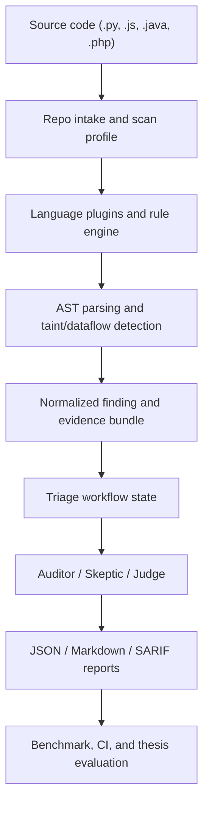

# Aegis-SAST

Aegis-SAST is a thesis-scale Hybrid SAST platform that combines deterministic static analysis with evidence-aware AI triage. The repository is no longer just a simple AST demo: it already contains a multi-language plugin framework, a Python graph-analysis lane, normalized findings and triage records, workflow-state orchestration, SARIF export, and an initial benchmark track for research evaluation.

The project is being developed toward a larger graduation-thesis and NCKH scope:

- Python is the deep research lane.
- JavaScript and Java are the breadth lanes that must work in practice.
- Semgrep is the first industrial baseline to integrate.
- LangGraph, Local LLM, and RAG are the target AI workflow layer.
- Benchmarking is a required research contribution, not an optional extra.

## Why this repository matters

Traditional SAST tools often optimize recall but produce too many false positives, which makes manual review slow and expensive. Aegis-SAST is aimed at the space between:

- rule-based static analysis that is deterministic but noisy; and
- LLM-based triage that is flexible but weak if it receives poor evidence.

The core idea is to strengthen the scanner first, then feed compact and structured evidence into an AI triage workflow.

## Current architecture



## Current technical position

| Area | Status now | Notes |
|---|---|---|
| Multi-language plugin framework | Implemented | Python, JavaScript, Java, PHP |
| Rule-based detection | Implemented | YAML rules for sources, sinks, sanitizers |
| Python graph core | Implemented | Explicit CFG/DFG, taint kill, dead-path pruning, loop control, function summary |
| JavaScript lane | Basic | Intra-file parsing and taint heuristics |
| Java lane | Basic | Intra-file parsing and taint heuristics |
| PHP lane | Basic | Intra-file plugin exists, not the main research focus |
| Normalized findings | Implemented | Shared schema for reporting and triage |
| Knowledge-assisted triage | Implemented | Knowledge cards and triage engine seed |
| Workflow-state orchestration | Implemented | LangGraph-ready node structure and route metadata |
| SARIF export | Implemented | JSON, Markdown, SARIF |
| Python graph benchmark | Implemented | Synthetic ablation dataset and benchmark runner |
| Semgrep adapter | Planned | Baseline and industrial comparison |
| Local LLM / RAG | Planned | Next AI layer after evidence and workflow |
| Fine-tuning / LoRA | Planned | Stretch goal after labeled triage data exists |

## Analysis depth by language

One of the most important scope decisions in this repository is to separate depth from breadth.

| Language | Current depth | What that means |
|---|---|---|
| Python | Deep | Explicit CFG/DFG lane, function summaries, graph metadata, benchmark track |
| JavaScript | Intra-file | Tree-sitter parsing, source/sink/sanitizer extraction, basic taint heuristics |
| Java | Intra-file | Tree-sitter parsing, source/sink/sanitizer extraction, basic taint heuristics |
| PHP | Intra-file | Plugin lane exists, but not the primary thesis contribution |

This is intentional. Python is the research contribution lane; JavaScript and Java are the practical multi-language breadth lanes.

## Repository layout

```text
aegis_sast/        core scanner, plugins, analysis, triage, orchestration, integrations
benchmarks/        benchmark outputs and future baseline comparisons
datasets/          synthetic and labeled evaluation assets
docs/thesis/       thesis, defense, roadmap, and research planning documents
examples/          intentionally vulnerable demo files
refs/              local reference snapshots (ignored by git)
scripts/           smoke tests, environment checks, benchmark runners
test_projects/     manual local scan targets
tests/             unit and regression tests
```

## Thesis-scale progress already completed

The recent thesis-focused work from `docs/thesis/20..31` established four major layers:

1. Triage and workflow foundation
2. Environment and runtime stability
3. Python graph-analysis core
4. Research evaluation through a mini benchmark

The next roadmap is captured in [docs/thesis/32-roadmap-4-6-thang-hybrid-sast-agent.md](docs/thesis/32-roadmap-4-6-thang-hybrid-sast-agent.md).

## Installation

### Recommended environment

Use official CPython on Windows, Linux, or macOS. Do not build the working environment from MSYS2/UCRT Python if you expect `tree-sitter` packages to install reliably.

```bash
python scripts/doctor_env.py
py -3.12 -m venv .venv
```

Windows PowerShell:

```powershell
.\.venv\Scripts\Activate.ps1
python -m pip install --upgrade pip
python -m pip install -r requirements.txt
python -m pip install -r requirements-ai.txt
python -m pip install -r requirements-dev.txt
```

Linux / macOS / Git Bash:

```bash
source .venv/bin/activate
python -m pip install --upgrade pip
python -m pip install -r requirements.txt
python -m pip install -r requirements-ai.txt
python -m pip install -r requirements-dev.txt
```

If you only need the module entrypoint, `python -m aegis_sast.cli ...` is enough. The editable install is optional:

```bash
python -m pip install -e . --no-deps
```

## Quick start

Scan a single file:

```bash
python -m aegis_sast.cli scan examples/vulnerable_sqli.py --no-ai
```

At startup the CLI now prints analyzer availability so you can see whether Python, JavaScript, Java, and PHP plugins were loaded successfully in the current environment.

Scan a directory:

```bash
python -m aegis_sast.cli scan test_projects/ --no-ai --output json --output markdown --output sarif
```

Export to a custom output directory:

```bash
python -m aegis_sast.cli scan examples/vulnerable_sqli.py --no-ai --output json --output markdown --output sarif --output-dir reports/manual_smoke
```

## Useful development commands

Environment and workflow smoke:

```bash
python scripts/doctor_env.py
python scripts/manual_smoke.py
```

Python graph-core smoke:

```bash
python scripts/manual_graph_smoke.py
```

Python graph ablation benchmark:

```bash
python scripts/benchmark_python_graph_ablation.py
```

## Report outputs

Aegis-SAST currently exports:

- JSON for structured downstream processing
- Markdown for fast manual review
- SARIF for CI/code-scanning oriented workflows

Workflow metadata and triage summaries are carried into the reports so that findings are not just a flat list of alerts.

## Current limitations

The repository is stronger than an early prototype, but it is still honest about its limits:

- Python is the only deep graph-analysis lane today.
- JavaScript, Java, and PHP are currently shallower than Python.
- Cross-file reasoning is currently Python-first.
- Full LangGraph integration is not complete yet.
- Local LLM, RAG, Semgrep adapter, and fine-tuning are roadmap items, not finished features.
- Missing `tree-sitter` dependencies can make analyzers unavailable in a runtime environment.

## Roadmap focus for the next 4-6 months

The roadmap is deliberately heavy, but it is heavy in the right places:

1. Make JavaScript and Java visible and usable in practice, with examples, smoke tests, and benchmark mini-tracks.
2. Push Python from graph core into evidence slicing / CPG-lite for stronger research contribution.
3. Integrate Semgrep as the first industrial baseline.
4. Turn the current staged workflow into a real LangGraph triage pipeline.
5. Add Local LLM + RAG for private, evidence-aware triage and remediation planning.
6. Expand benchmarking into a thesis-grade evaluation layer.

The detailed technical roadmap lives in [docs/thesis/32-roadmap-4-6-thang-hybrid-sast-agent.md](docs/thesis/32-roadmap-4-6-thang-hybrid-sast-agent.md).

## Thesis documentation

The thesis and defense planning documents are organized under [docs/thesis](docs/thesis/). Start with:

1. [docs/thesis/00-tong-hop-da-lam.md](docs/thesis/00-tong-hop-da-lam.md)
2. [docs/thesis/04-kien-truc-muc-tieu.md](docs/thesis/04-kien-truc-muc-tieu.md)
3. [docs/thesis/15-phase-3-thang-va-phan-cong-quan-tue.md](docs/thesis/15-phase-3-thang-va-phan-cong-quan-tue.md)
4. [docs/thesis/16-de-cuong-bao-cao-de-tai-ban-giang-vien.md](docs/thesis/16-de-cuong-bao-cao-de-tai-ban-giang-vien.md)
5. [docs/thesis/17-lo-trinh-ast-dfg-cfg-va-agent.md](docs/thesis/17-lo-trinh-ast-dfg-cfg-va-agent.md)
6. [docs/thesis/32-roadmap-4-6-thang-hybrid-sast-agent.md](docs/thesis/32-roadmap-4-6-thang-hybrid-sast-agent.md)

For the full index, see [docs/thesis/README.md](docs/thesis/README.md).
