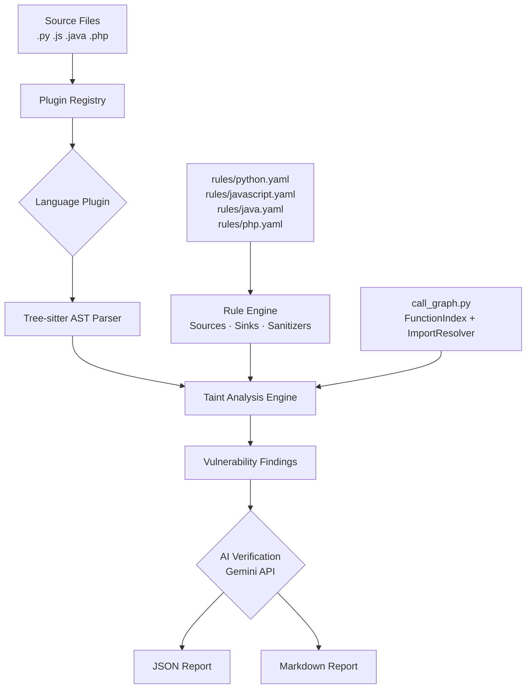

<div align="center">

# 🔒 Aegis-SAST

**AI-Powered Static Application Security Testing Tool**

*Built for penetration testers and security engineers — finds vulnerabilities before attackers do.*

[](https://python.org)
[](#language-support)
[](https://owasp.org/Top10/)
[](LICENSE)

</div>

---

## What is Aegis-SAST?

Aegis-SAST is a **static analysis tool** that scans source code for security vulnerabilities using a two-layer approach:

1. **Layer 1 — Tree-sitter AST Analysis**: Parses source code into an Abstract Syntax Tree and tracks how untrusted user input (sources) flows into dangerous functions (sinks) without being sanitized — this is called **Taint Analysis**.
2. **Layer 2 — Gemini AI Verification**: Each potential finding is verified by Google Gemini to reduce false positives and provide remediation advice.

> This tool is designed to detect real, exploitable vulnerabilities — not just flag dangerous function names.

---

## Architecture



## Repository Layout

The repository is now organized to separate product code, research assets, and
developer fixtures more clearly:

```text
aegis_sast/        core scanner, plugins, analysis, triage, orchestration, integrations
benchmarks/        baseline comparison plans and evaluation fixtures
datasets/          synthetic or labeled research datasets
docs/thesis/       graduation-thesis and defense documents
examples/          user-facing demo samples
refs/              third-party reference snapshots
scripts/           workflow utilities and future benchmark helpers
skills/            local skill pack for agent-oriented development
test_projects/     quick local scan targets for manual debugging
tests/             unit and regression tests
```

Design direction:

- `aegis_sast/analysis` remains the deterministic core
- `aegis_sast/triage` holds normalized finding and review decisions
- `aegis_sast/orchestration` is reserved for workflow and LangGraph-style state
- `aegis_sast/knowledge` is reserved for YAML knowledge cards and loaders
- `aegis_sast/integrations` contains CI-facing export formats such as SARIF

### How Taint Analysis Works

```
Source (untrusted input)
  │
  │  request.args.get('id')          ← HTTP parameter
  ▼
Propagation (variable tracking)
  │
  │  user_id = request.args.get('id')
  │  query   = f"SELECT * FROM users WHERE id={user_id}"
  ▼
Sink (dangerous function)
  │
  │  db.execute(query)               ← SQL Injection!
  ▼
Finding: [CRITICAL] SQL_INJECTION @ app.py:42
```

### Cross-file Tracking (Level-B Inter-procedural)

```
utils.py                         app.py
─────────────────────            ──────────────────────────
def get_command():               from utils import get_command
    cmd = request.args.get('cmd')
    return cmd                   cmd = get_command()  ← Synthetic source
                                 os.system(cmd)       ← SINK detected!
```

---

## Features

### Language Support

| Language | Extensions | Parser |
|---|---|---|
| 🐍 Python | `.py`, `.pyw` | tree-sitter-python |
| 🟨 JavaScript / Node.js | `.js`, `.mjs`, `.cjs` | tree-sitter-javascript |
| ☕ Java | `.java` | tree-sitter-java |
| 🐘 PHP | `.php`, `.phtml` | tree-sitter-php |

### OWASP Top 10 Coverage

| Vulnerability | Python | JavaScript | Java | PHP |
|---|:---:|:---:|:---:|:---:|
| SQL Injection | ✅ | ✅ | ✅ | ✅ |
| Command Injection (RCE) | ✅ | ✅ | ✅ | ✅ |
| Code Injection | ✅ | ✅ | ✅ | ✅ |
| Path Traversal / LFI | ✅ | ✅ | ✅ | ✅ |
| Cross-Site Scripting (XSS) | ✅ | ✅ | ✅ | ✅ |
| Server-Side Request Forgery | ✅ | ✅ | ✅ | ✅ |
| XML External Entity (XXE) | ✅ | — | ✅ | ✅ |
| NoSQL Injection | ✅ | ✅ | — | — |
| Insecure Deserialization | ✅ | ✅ | ✅ | ✅ |
| SSTI | ✅ | — | — | — |
| IDOR | ✅ | — | — | — |
| Mass Assignment | ✅ | — | — | — |
| Open Redirect | ✅ | ✅ | ✅ | — |

### Key Capabilities

| Feature | Details |
|---|---|
| **AST-based analysis** | Uses Tree-sitter for precise, language-aware parsing — not just regex |
| **Taint flow tracking** | Follows data from `source → variable → sink` through assignments and aliasing |
| **Cross-file analysis** | Detects vulnerabilities that span multiple files via import tracking |
| **Sanitizer awareness** | Recognises safe functions (e.g. `parameterized queries`, `htmlspecialchars`) and marks paths as low-risk |
| **AI Verification** | Gemini API verifies each finding to suppress false positives |
| **Reports and CI** | JSON, Markdown, and SARIF export for CI/CD and code scanning workflows |
| **Docker support** | Run without installing anything locally |

---

## Installation

### Option 1: pip (recommended)

```bash
# Clone the repository
git clone https://github.com/PhucQuan/SAST_tool4pentester.git
cd SAST_tool4pentester

# Install
pip install -e .

# Set up Gemini API key (optional — tool works without AI verification)
cp .env.example .env
# Edit .env and add your GEMINI_API_KEY
```

### Option 2: Docker

```bash
docker build -t aegis-sast .
docker run --rm -v $(pwd)/target:/scan aegis-sast scan /scan
```

---

## Quick Start

```bash
# Scan a single Python file
aegis-sast scan app.py

# Scan an entire project directory (all languages)
aegis-sast scan ./my_project/

# Scan without AI verification (faster)
aegis-sast scan ./my_project/ --no-ai

# Output only JSON report, to a custom directory
aegis-sast scan ./my_project/ --output json --output-dir ./results/

# Export SARIF for GitHub code scanning or CI pipelines
aegis-sast scan ./my_project/ --output sarif --output-dir ./results/
```

### Example Output

```
╭─────────────────────────────────╮
│ 🔒 Aegis-SAST Security Scanner  │
│ AI-Powered Static Analysis Tool │
╰─────────────────────────────────╯

🔍 Scanning: examples/vulnerable_sqli.py

┏━━━━━━━━━━━━━━━━┳━━━━━━━━━━━┓
┃ Metric         ┃     Value ┃
┡━━━━━━━━━━━━━━━━╇━━━━━━━━━━━┩
│ Files Scanned  │         1 │
│ Total Findings │         5 │
│ 🔴 Critical    │         3 │
│ 🟠 High        │         1 │
│ 🟡 Medium      │         1 │
└────────────────┴───────────┘

⚠️  CRITICAL vulnerabilities found!
```

---

## How to Use Results

Each report (JSON and Markdown) contains for every finding:

- **Vulnerability type** (e.g. `SQL_INJECTION`)
- **Severity** (`CRITICAL` / `HIGH` / `MEDIUM` / `LOW`)
- **Source location** — the file and line where untrusted input enters
- **Sink location** — the file and line of the dangerous function
- **AI confidence score** and **remediation recommendation** (when AI is enabled)

---

## Configuration

| CLI Flag | Default | Description |
|---|---|---|
| `--no-ai` | AI enabled | Disable Gemini AI verification |
| `--max-depth` | `5` | Maximum taint propagation depth |
| `--output` | `json,markdown` | Output format(s): `json`, `markdown`, `sarif` |
| `--output-dir` | `reports/` | Directory for report files |
| `--rules` | auto | Path to custom rules YAML file |

---

## Writing Custom Rules

Rules are defined in YAML files under `rules/`. Here is the structure:

```yaml
sources:
  - pattern: "request.args.get"
    type: "HTTP_PARAM"
    severity: "HIGH"

sinks:
  sqli:
    - pattern: ".execute("
      type: "SQL_INJECTION"
      severity: "CRITICAL"
      description: "Raw SQL execution"

sanitizers:
  - pattern: "parameterize("
    mitigates: ["SQL_INJECTION"]
    description: "Safe parameterized query"
```

To add a new language: create `rules/<language>.yaml` and implement `aegis_sast/plugins/<language>_plugin.py`.

---

## Limitations

> [!NOTE]
> Understanding the limitations helps interpret results accurately.

| Limitation | Explanation |
|---|---|
| **Intra-project analysis only** | Cross-file tracking works within the same project directory via explicit imports. Third-party library internals are not traversed. |
| **No dynamic analysis** | `__import__()`, `importlib`, runtime reflection are not resolved — only static `from X import Y` statements. |
| **Conservative taint** | When a function has multiple return paths, all are treated as tainted if any is tainted (may cause false positives). |
| **Python cross-file only** | Cross-file tracking currently only supports Python. JS/Java/PHP work intra-file. |
| **Not a WAF replacement** | This tool finds code patterns; it does not test a running application. |

---

## Project Structure

```
aegis_sast/
├── ai/
│   ├── gemini_client.py        # Gemini API integration
│   └── prompts.py              # Vulnerability-specific prompt templates
├── analysis/
│   ├── call_graph.py           # FunctionIndex + ImportResolver (cross-file)
│   ├── rule_engine.py          # YAML rule loader
│   └── vulnerability_detector.py  # Main scan orchestrator
├── core/
│   ├── models.py               # Data models (Vulnerability, TaintSource, etc.)
│   ├── plugin_interface.py     # Abstract base for language plugins
│   └── registry.py             # Plugin auto-registration
└── plugins/
    ├── python_plugin.py        # Python / Flask / Django
    ├── javascript_plugin.py    # Node.js / Express
    ├── java_plugin.py          # Java / Spring
    └── php_plugin.py           # PHP / Laravel
rules/
    ├── python.yaml
    ├── javascript.yaml
    ├── java.yaml
    └── php.yaml
```

---

## Development

```bash
# Run unit tests
pytest tests/ -v

# Run against example vulnerable files
aegis-sast scan examples/ --no-ai
```

---

## License

MIT License — see [LICENSE](LICENSE) for details.

---

<div align="center">
  <sub>Built as a Penetration Testing portfolio project · Python · Tree-sitter · Gemini AI</sub>
</div>
