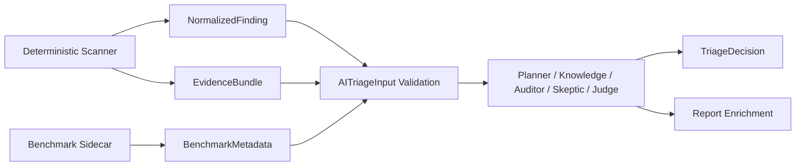

# AI Gap Analysis

Date: 2026-07-29

## Current Status

The AI layer now has a locked Pydantic contract for normalized findings, evidence bundles, benchmark metadata, node outputs, and agent workflow state. The deterministic scanner remains responsible for repository parsing, AST, CFG/DFG, taint propagation, and source-to-sink evidence extraction.

## Modules to Keep

- `aegis_sast/triage/engine.py`: deterministic triage bridge remains useful for current scanner output.
- `aegis_sast/orchestration/router.py`: existing deterministic route metadata can seed AI conditional routing.
- `aegis_sast/orchestration/context.py`: source-context loading is kept in deterministic orchestration, not inside AI node prompts.
- `aegis_sast/knowledge/loader.py`: retained and extended for multilingual CWE card selection.
- `aegis_sast/ai/gemini_client.py`: legacy Gemini verification client remains, but needs structured-output hardening.

## Modules Changed

- `aegis_sast/triage/schema.py`: Pydantic AI contract with finding/evidence ID matching, graph metadata, static confidence, and structured decision metadata.
- `aegis_sast/orchestration/contracts.py`: Pydantic node output contracts for auditor, skeptic, and judge workflow data.
- `aegis_sast/orchestration/state.py`: Pydantic state for scanner workflow and AI-only workflow inputs.
- `aegis_sast/knowledge/loader.py`: now loads legacy cards plus multilingual AI cards and can select the smallest relevant language/framework section.

## Modules Added

- `aegis_sast/knowledge/schema.py`: structured Knowledge Card and selection schemas.
- `aegis_sast/knowledge/cards/*.yaml`: five priority multilingual CWE cards.
- `aegis_sast/ai/fixtures.py`: mock AI finding batch loader and ground-truth sidecar loader.
- `docs/ai_contract.md`: locked AI contract documentation.
- `docs/AI_GAP_ANALYSIS.md`: this gap analysis.
- `tests/fixtures/ai_findings/`: mock fixtures for Python, JavaScript, Java, and PHP.

## Modules Still Needed

- `aegis_sast/ai/schemas.py`: Gemini request/response envelopes and normalized errors.
- `aegis_sast/ai/retry.py`: bounded retry policy for invalid JSON, timeout, and rate limit.
- `aegis_sast/ai/token_tracker.py`: token, latency, model, route, and invalid-output metrics.
- LangGraph-backed workflow adapter once `langgraph` is added as an optional dependency.
- AI ablation scripts for E1, E2, and E3.

## Data Flow

## Environment Notes

- Python in the local run was `3.13.9`.
- Pydantic `2.12.4` is available.
- `google-genai` is optional and is not required for default tests.
- `langgraph` is not currently a runtime dependency, so the current workflow is LangGraph-ready but not yet a compiled LangGraph graph.

## Remaining Risks

- Gemini structured-output handling still uses the legacy verification path.
- Mock fixtures are intentionally small and need expansion to 25-35 cases from Quân.
- Full test suite has an unrelated existing graph-count expectation that can vary with parser/runtime behavior.
