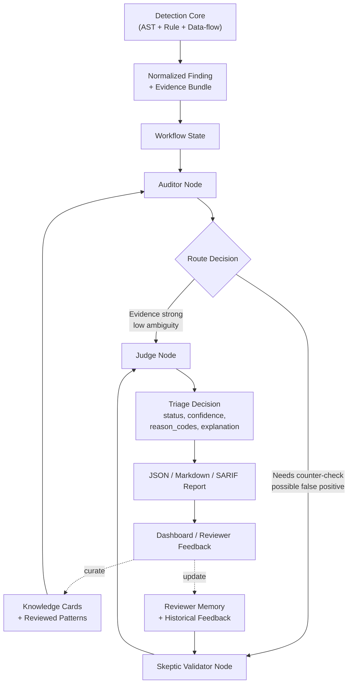

# Báo cáo tổng hợp hiện trạng Aegis-SAST, kết quả benchmark, quy trình demo và định hướng phát triển tiếp theo

## 1. Mục đích của tài liệu

Tài liệu này được biên soạn nhằm tổng hợp một cách hệ thống những nội dung quan trọng nhất của dự án **Aegis-SAST** tại thời điểm hiện tại, phục vụ cho các mục đích: báo cáo tiến độ với giảng viên hướng dẫn, làm cơ sở viết khóa luận, chuẩn bị nội dung thuyết trình, cũng như chuẩn hóa quy trình demo và benchmark.

Cụ thể, tài liệu tập trung vào năm nội dung chính:

1. Mô tả Aegis-SAST đang giải quyết bài toán gì và đang ở trạng thái phát triển nào.
2. Trình bày kiến trúc hiện tại của hệ thống, đối chiếu trực tiếp với các thành phần đã có trong mã nguồn.
3. Tổng hợp các kết quả kỹ thuật đã hoàn thành, bao gồm scanner core, cơ chế triage, dashboard và benchmark.
4. Báo cáo kết quả thực nghiệm trên bộ dữ liệu chuẩn OWASP Benchmark, đồng thời so sánh với baseline Semgrep.
5. Đề xuất cách demo phù hợp và xác định các hướng phát triển tiếp theo một cách trung thực, không vượt quá phạm vi hiện thực của hệ thống.

Vì đây là tài liệu hướng tới việc đọc và đánh giá ở góc độ học thuật, toàn bộ nội dung được trình bày theo văn phong báo cáo, hạn chế tối đa cách diễn đạt mang tính ghi chú nội bộ.

## 2. Tổng quan về hệ thống Aegis-SAST

Aegis-SAST hiện tại là một hệ thống **phân tích mã nguồn tĩnh theo hướng hybrid**, trong đó phần lõi phát hiện lỗ hổng được xây dựng theo hướng **deterministic static analysis** dựa trên AST, luật phát hiện và cơ chế lần vết dữ liệu; còn thành phần AI được đặt ở lớp trên nhằm hỗ trợ **triage**, diễn giải phát hiện và mở đường cho các khả năng như reviewer memory hoặc remediation trong các giai đoạn tiếp theo.

Nói cách khác, hệ thống không được định vị như một công cụ “LLM thay thế hoàn toàn static analysis engine”, mà được xây dựng theo hướng thận trọng và thực tiễn hơn:

- **Lõi phát hiện** chịu trách nhiệm quét mã nguồn, trích xuất source, sink, sanitizer và dựng bằng chứng data-flow.
- **Lớp triage và workflow** chịu trách nhiệm chuẩn hóa kết quả, đánh giá mức độ thuyết phục của finding, hỗ trợ giảm nhiễu.
- **Lớp AI** không đóng vai trò detector chính, mà là lớp bổ trợ nhằm kiểm tra lại finding, sinh explanation và tạo nền tảng cho những vòng phản hồi thông minh hơn.
- **Lớp sản phẩm** gồm report exporter và dashboard, phục vụ mục tiêu demo, quan sát finding và tương tác reviewer.

Với cách tiếp cận này, Aegis-SAST phù hợp với định hướng nghiên cứu hiện tại: kết hợp ưu điểm của static analysis truyền thống (ổn định, có thể benchmark được, dễ kiểm chứng) với ưu điểm của AI ở khâu triage và hỗ trợ người dùng.

## 3. Kiến trúc hiện tại của hệ thống

### 3.1. Cái nhìn tổng thể

Xét theo cấu trúc thực tế của codebase, Aegis-SAST hiện tại đã hình thành tương đối rõ một kiến trúc nhiều lớp, tương ứng khá sát với hướng kiến trúc mục tiêu đã mô tả trong tài liệu `docs/thesis/04-kien-truc-muc-tieu.md`. Kiến trúc này có thể được chia thành các tầng sau:

1. Tầng **điểm vào và điều phối thực thi**.
2. Tầng **repo intake và phân tích đặc tính đầu vào**.
3. Tầng **phát hiện lỗ hổng (detection core)**.
4. Tầng **chuẩn hóa finding**.
5. Tầng **workflow triage**.
6. Tầng **AI overlay**.
7. Tầng **reporting và product layer**.
8. Tầng **benchmark và evaluation**.

Việc tách lớp như vậy là một điểm mạnh đáng chú ý của dự án, bởi nó giúp tránh tình trạng “tất cả logic nằm trong một file CLI”, đồng thời tạo điều kiện thuận lợi cho việc mở rộng sau này sang API, dashboard hoặc CI pipeline.

### 3.2. Đối chiếu kiến trúc với các module trong mã nguồn

Bảng dưới đây trình bày việc ánh xạ các tầng chức năng sang những module chính hiện có trong dự án:

| Tầng chức năng | Thành phần chính trong mã nguồn | Vai trò hiện tại |
|---|---|---|
| Điểm vào CLI | `aegis_sast/cli.py` | Nhận tham số dòng lệnh, khởi chạy pipeline, in kết quả theo định dạng terminal |
| Orchestration service | `aegis_sast/orchestration/service.py` | Điều phối luồng scan từ intake đến export report |
| Repo intake | `aegis_sast/orchestration/repo_intake.py` | Nhận diện ngôn ngữ, profile, framework hints và lập kế hoạch quét |
| Detection core | `aegis_sast/analysis/vulnerability_detector.py` | Phân tích file, áp dụng plugin, luật và cơ chế data-flow |
| Rule engine | `aegis_sast/analysis/rule_engine.py` | Nạp và quản lý rules theo ngôn ngữ |
| Normalized models | `aegis_sast/core/models.py` | Định nghĩa schema finding, severity, vulnerability families |
| Python plugin | `aegis_sast/plugins/python_plugin.py` | Plugin mạnh nhất hiện tại, có lane phân tích sâu cho Python |
| Java plugin | `aegis_sast/plugins/java_plugin.py` | Plugin Java với khả năng intra-file data-flow |
| JavaScript plugin | `aegis_sast/plugins/javascript_plugin.py` | Plugin JavaScript/Node.js với heuristic data-flow trong phạm vi file |
| Workflow triage | `aegis_sast/orchestration/workflow.py` | Điều phối logic auditor/skeptic/judge |
| Deterministic triage | `aegis_sast/triage/engine.py` | Chuẩn hóa và phân loại finding theo schema triage |
| AI triage runner | `aegis_sast/triage/ai_runner.py` | Gọi AI để re-review finding sau lớp deterministic |
| Gemini client | `aegis_sast/ai/gemini_client.py` | Kết nối Gemini API |
| JSON exporter | `aegis_sast/reporting/json_exporter.py` | Xuất report JSON |
| Markdown exporter | `aegis_sast/reporting/markdown_exporter.py` | Xuất report Markdown |
| SARIF formatter | `aegis_sast/integrations/sarif_formatter.py` | Xuất SARIF phục vụ CI / code scanning |
| Dashboard | `apps/findings-dashboard` | Giao diện local đọc report JSON và hỗ trợ review finding |
| Benchmark scorer | `scripts/score_owasp_benchmark.py` | Chấm TP/FP/FN theo ground truth OWASP Benchmark |
| Semgrep baseline runner | `scripts/run_semgrep_owasp_python.py` | Chạy baseline Semgrep để so sánh công bằng |

### 3.3. Làm rõ ranh giới kiến trúc để tránh lệch claim

Một điểm rất quan trọng cần được trình bày rõ trong báo cáo học thuật là **ranh giới giữa engine phát hiện của Aegis-SAST và các công cụ baseline được dùng để đối chiếu**.

Trong phiên bản hiện tại, **Aegis-SAST không kế thừa Semgrep, Bandit hay PMD làm engine quét runtime mặc định**. Thay vào đó, hệ thống sử dụng engine riêng của dự án, được tổ chức thông qua plugin AST, luật phát hiện và cơ chế taint/data-flow analysis. Các công cụ như Semgrep chỉ được sử dụng ở vai trò **baseline benchmark**, nhằm tạo một mốc so sánh khách quan khi đánh giá chất lượng phát hiện của hệ thống.

Việc làm rõ ranh giới này có ý nghĩa rất lớn khi bảo vệ khóa luận. Nếu không phân biệt rõ, người đọc rất dễ hiểu nhầm rằng Aegis chỉ là một lớp giao diện bao ngoài Semgrep. Trong khi đó, trên thực tế, Aegis đã có một detector riêng, còn Semgrep được dùng như một mốc tham chiếu trong thí nghiệm.

### 3.4. Vai trò của kiến trúc multi-agent theo hướng LangGraph

Một nội dung quan trọng khác cần được trình bày rõ trong báo cáo là **vai trò của kiến trúc multi-agent trong Aegis-SAST**. Đây là phần rất dễ gây hiểu nhầm nếu chỉ nhìn bề ngoài vào các khái niệm như `auditor`, `skeptic`, `judge` mà không đối chiếu với mã nguồn thực tế.

Về mặt định hướng kiến trúc, dự án xác định **LangGraph, Local LLM và RAG** là lớp AI workflow mục tiêu trong giai đoạn phát triển tiếp theo. Điều này đã được phản ánh trong tài liệu tổng quan của repository. Ở trạng thái hiện tại, hệ thống **đã bổ sung dependency LangGraph và một lớp bridge tối thiểu** để bọc workflow hiện có dưới dạng graph thực thi. Tuy nhiên, dự án vẫn đang ở giai đoạn trung gian: trọng tâm hiện nay là hoàn thiện **workflow state có cấu trúc, các node chuyên biệt và metadata route/trace ổn định**, trước khi mở rộng thành một graph nhiều node hoàn chỉnh theo đúng tinh thần LangGraph.

Nói cách khác, Aegis-SAST hiện tại nên được mô tả là một hệ thống **đã bắt đầu tích hợp LangGraph ở mức bridge và entrypoint**, đồng thời vẫn giữ bản chất là **LangGraph-ready multi-agent workflow**. Hệ thống chưa nên được mô tả là một nền tảng “đã hoàn tất LangGraph orchestration đa node end-to-end”.

Sơ đồ dưới đây mô tả cách kiến trúc triage đa tác tử của Aegis-SAST đang được tổ chức theo hướng có thể ánh xạ sang LangGraph trong giai đoạn tiếp theo:



**Gợi ý chú thích hình dùng trong khóa luận**

*Hình X. Luồng triage đa tác tử theo hướng LangGraph trong Aegis-SAST. Detection Core thực hiện phát hiện lỗ hổng ban đầu bằng AST, rule và data-flow analysis; sau đó finding được chuẩn hóa và đưa vào workflow state để các vai trò auditor, skeptic và judge phối hợp đánh giá. Reviewer feedback từ dashboard được lưu lại dưới dạng triage memory và reviewed patterns nhằm hỗ trợ các vòng đánh giá tiếp theo.*

**Gợi ý đoạn thuyết minh có thể dùng trực tiếp trong phần thiết kế hệ thống**

Luồng trong Hình X mô tả lớp triage đa tác tử của Aegis-SAST, được đặt sau lớp phát hiện lỗ hổng deterministic. Ở giai đoạn đầu, Detection Core chịu trách nhiệm quét mã nguồn và sinh ra các finding kèm evidence bundle, bao gồm thông tin source, sink, intermediate steps, sanitizer và metadata liên quan. Các finding này sau đó được chuẩn hóa về một schema thống nhất và nạp vào workflow state để phục vụ cho quá trình điều phối nhiều vai trò đánh giá.

Trong workflow này, `Auditor Node` đóng vai trò tổng hợp và diễn giải bằng chứng ban đầu. Tác tử này đọc evidence bundle, kết hợp với knowledge cards và reviewed patterns để ước lượng mức độ thuyết phục của finding, đồng thời quyết định finding nên đi thẳng tới bước phán quyết hay cần qua một vòng phản biện bổ sung. Nếu finding có evidence mạnh, đường đi dữ liệu rõ ràng và ít tín hiệu mơ hồ, workflow có thể chuyển trực tiếp sang `Judge Node`. Ngược lại, nếu finding thuộc nhóm dễ gây false positive, có sanitizer, guard clause hoặc tín hiệu giảm nhẹ, finding sẽ được chuyển qua `Skeptic Validator Node`.

`Skeptic Validator Node` là tác tử phản biện, có nhiệm vụ tìm kiếm các bằng chứng chống lại giả thuyết “finding là lỗ hổng thật”. Tác tử này khai thác reviewer memory và historical feedback để đối chiếu với các mẫu false positive đã biết, đồng thời xem xét các tín hiệu giảm thiểu trong mã nguồn như validation, escaping, prepared statements hoặc guard conditions. Kết quả của bước phản biện không thay thế finding gốc, mà bổ sung thêm một lớp nhận định giúp giảm nhiễu trước khi chuyển sang bước quyết định cuối cùng.

`Judge Node` là tác tử tổng hợp cuối cùng. Dựa trên đầu ra từ auditor và skeptic, tác tử này chốt trạng thái triage của finding theo các trường như `status`, `confidence`, `reason_codes` và `explanation`. Quyết định này sau đó được xuất ra các định dạng JSON, Markdown hoặc SARIF để phục vụ review thủ công, tích hợp CI hoặc hiển thị trên dashboard. Phản hồi của reviewer trên dashboard không tác động trực tiếp vào detector runtime, mà được đưa trở lại các lớp `Reviewer Memory` và `Reviewed Patterns`, từ đó tạo thành vòng lặp cải tiến dần chất lượng triage trong các lần chạy sau.

Về mặt kiến trúc, sơ đồ này không mô tả toàn bộ hệ thống Aegis-SAST, mà mô tả riêng **tiểu quy trình triage đa tác tử** nằm sau lớp detection. Đây là một distinction quan trọng, bởi nó khẳng định rằng multi-agent trong Aegis được đặt đúng vai trò: hỗ trợ đánh giá và giảm false positive sau khi scanner core đã tạo ra evidence tương đối ổn định. Cách tổ chức này cũng phù hợp với định hướng tích hợp LangGraph, vì workflow state, route decision và node contracts đã được xác lập rõ ràng ngay từ giai đoạn hiện tại.

Trong mã nguồn hiện tại, tinh thần multi-agent đã được thể hiện khá rõ thông qua các vai trò xử lý tách biệt:

- `AuditorNode` chịu trách nhiệm tổng hợp bằng chứng, đọc ngữ cảnh source/sink, đánh giá strength của evidence và xác định route ban đầu cho finding.
- `SkepticValidatorNode` đóng vai trò phản biện, tìm các tín hiệu giảm nhẹ như sanitizer, guard clause, false-positive pattern hoặc dấu hiệu mơ hồ trong context.
- `JudgeNode` là tầng ra quyết định cuối cùng, tổng hợp đầu ra từ auditor và skeptic để chốt trạng thái triage, confidence, reason codes và metadata phục vụ export report.

Ba vai trò trên không đơn thuần là “đặt tên cho đẹp”, mà đã có hợp đồng dữ liệu tương đối rõ ràng và được thực thi trong workflow. Trong `aegis_sast/orchestration/workflow.py`, hệ thống duy trì `ScanWorkflowState`, lưu trữ:

- repo profile;
- normalized findings;
- triage records;
- workflow traces;
- route summary;
- auditor summary;
- skeptic summary;
- judge summary.

Chính nhờ cấu trúc state này, Aegis-SAST đã có nền tảng để chuyển từ một workflow tuần tự sang một **graph-based orchestration** trong tương lai. Đây là điểm quan trọng về mặt nghiên cứu, bởi nó cho phép xem multi-agent không chỉ như một tập prompt rời rạc, mà như một **chính sách điều phối triage có thể quan sát, lưu vết và benchmark**.

Ở góc độ học thuật, cách trình bày phù hợp nhất là:

- hiện tại, hệ thống **đã có decomposition theo vai trò multi-agent** ở mức node và workflow-state;
- hệ thống **đã sẵn sàng về mặt dữ liệu và contract để tích hợp LangGraph thật**;
- nhưng hệ thống **chưa nên được claim là đã hoàn tất LangGraph orchestration end-to-end**.

Việc trình bày như vậy có hai lợi ích. Thứ nhất, nó phản ánh trung thực trạng thái của codebase. Thứ hai, nó vẫn giữ được giá trị nghiên cứu của phần multi-agent, vì đóng góp hiện tại không nằm ở việc “import thư viện LangGraph”, mà nằm ở việc **thiết kế được state, route và node contracts đủ rõ để multi-agent triage trở thành một lớp kiến trúc có thể mở rộng và đánh giá được**.

## 4. Những kết quả kỹ thuật đã hoàn thành

### 4.1. Hoàn thiện scanner core có khả năng hoạt động thực tế

Một kết quả đáng ghi nhận là dự án đã vượt ra khỏi mức “ý tưởng kiến trúc” hoặc “demo học tập đơn giản”. Hệ thống hiện đã có một scanner core có khả năng hoạt động thực tế, bao gồm các bước:

- phân tích cú pháp mã nguồn bằng Tree-sitter;
- nhận diện source, sink và sanitizer theo rule;
- theo dõi luồng dữ liệu từ source tới sink;
- dedupe finding;
- gán severity;
- xuất kết quả thành report.

Điều này cho phép Aegis-SAST không chỉ dừng ở mức trình diễn giao diện hay mô phỏng logic, mà đã có một lõi kỹ thuật đủ để benchmark trên bộ dữ liệu chuẩn.

### 4.2. Xây dựng cấu trúc plugin đa ngôn ngữ

Hệ thống hiện có plugin cho nhiều ngôn ngữ, bao gồm:

- Python
- Java
- JavaScript
- PHP

Ý nghĩa của kết quả này không chỉ nằm ở số lượng ngôn ngữ được hỗ trợ, mà còn nằm ở việc kiến trúc plugin đã được tổ chức đủ rõ ràng để cho phép mở rộng thêm rule hoặc logic phân tích mà không cần viết lại toàn bộ hệ thống. Đây là một lợi thế quan trọng về mặt thiết kế phần mềm.

### 4.3. Hình thành “Python deep lane” có chất lượng tốt nhất

Trong toàn bộ hệ thống hiện tại, Python là lane có chất lượng triển khai và mức độ trưởng thành cao nhất. Điều này được thể hiện ở các điểm sau:

- có plugin phân tích sâu hơn các ngôn ngữ khác;
- có khả năng data-flow tốt hơn;
- có bằng chứng benchmark tốt nhất trên OWASP Benchmark Python;
- có các family đạt recall rất cao trong nhóm injection và traversal.

Vì vậy, nếu cần xác định một lane chính để sử dụng trong claim học thuật của khóa luận, Python là lựa chọn hợp lý nhất ở thời điểm hiện tại.

### 4.4. Tách orchestration ra khỏi CLI

Một cải tiến quan trọng về kiến trúc là việc tách phần orchestration khỏi CLI và đưa vào `aegis_sast/orchestration/service.py`.

Trước đây, nếu toàn bộ logic scan, triage và export nằm trực tiếp trong CLI, hệ thống sẽ rất khó mở rộng. Sau khi tách ra:

- CLI chỉ còn là lớp nhận tham số và hiển thị;
- scan pipeline trở thành một service có thể tái sử dụng;
- dashboard hoặc các script benchmark có thể gọi lại pipeline mà không phải đi vòng qua lớp giao diện terminal.

Đây là thay đổi giúp kiến trúc trở nên “sạch” hơn, đồng thời là nền tảng để phát triển các hướng như API scan, PR scan hoặc workflow orchestration trong tương lai.

### 4.5. Xây dựng workflow triage có cấu trúc

Thay vì chỉ trả ra danh sách finding thô, hệ thống hiện đã có một lớp workflow triage với cấu trúc rõ ràng. Trong pipeline, finding có thể đi qua các bước đánh giá với vai trò tương tự:

- `auditor`
- `skeptic`
- `judge`

Ngoài ra, hệ thống cũng đã có schema triage và metadata phục vụ cho việc xuất explanation, route summary cũng như workflow summary trong report. Điều này rất quan trọng vì nó giúp Aegis tiến gần hơn tới mô hình “AI-assisted triage” mà nhiều hệ thống hiện đại đang theo đuổi, nhưng vẫn giữ được tính giải thích và khả năng kiểm soát.

### 4.6. Hoàn thiện lớp reporting và dashboard local

Một thành quả khác có giá trị demo rất cao là lớp product layer hiện đã hình thành khá rõ. Cụ thể:

- hệ thống có thể xuất report ở các định dạng JSON, Markdown và SARIF;
- dashboard local trong `apps/findings-dashboard` có thể đọc report JSON đã xuất;
- dashboard hỗ trợ finding list, detail view, filters, reviewer note, local feedback memory và local scan panel.

Điểm cần nhấn mạnh ở đây là dashboard **không gọi trực tiếp detector internals** như một giao diện gắn cứng vào engine. Thay vào đó, dashboard đọc report đã được chuẩn hóa. Đây là một quyết định kiến trúc đúng đắn, vì nó tách rời product layer khỏi detection core và giúp hệ thống dễ bảo trì hơn.

### 4.7. Hoàn thiện lớp benchmark và baseline comparison

Ở thời điểm hiện tại, dự án đã có những thành phần quan trọng để phục vụ đánh giá thực nghiệm:

- script chấm benchmark theo ground truth CSV;
- script chạy Semgrep baseline;
- cơ chế mapping family cho OWASP Benchmark Python;
- artifact report JSON/Markdown để lưu kết quả thí nghiệm.

Điều này có nghĩa là Aegis-SAST không còn chỉ là một công cụ “có vẻ hoạt động”, mà đã có nền tảng để được đánh giá bằng các chỉ số chuẩn như precision, recall và F1.

## 5. Phương pháp tiếp cận của đề tài

### 5.1. Định hướng hybrid: detector deterministic, AI ở lớp triage

Phương pháp kỹ thuật hiện tại của Aegis-SAST có thể được mô tả ngắn gọn như sau:

1. **Dùng deterministic static analysis làm detector chính**.
2. **Chuẩn hóa finding về một schema thống nhất**.
3. **Áp dụng workflow triage để đánh giá finding**.
4. **Sử dụng AI ở lớp trên để re-review, giải thích và hỗ trợ triage**.

Ưu điểm của cách tiếp cận này là:

- có thể benchmark được một cách khách quan;
- tránh việc đặt toàn bộ niềm tin vào đầu ra của LLM;
- phù hợp với xu hướng thực tế của nhiều hệ thống công nghiệp hiện nay, nơi AI thường được dùng để giảm false positive, hỗ trợ explanation hoặc remediation thay vì thay thế hoàn toàn engine phân tích.

### 5.2. Multi-agent được đặt ở lớp triage, không đặt ở lớp detection

Một quyết định thiết kế có tính định hướng của Aegis-SAST là **không đưa multi-agent vào vai trò detector chính**, mà đặt multi-agent ở lớp triage sau khi finding đã có evidence tương đối rõ từ scanner core.

Quyết định này xuất phát từ hai lý do. Thứ nhất, nếu evidence đầu vào còn yếu hoặc chưa ổn định, việc đưa nhiều agent vào tranh luận chỉ làm tăng chi phí token và độ phức tạp mà chưa chắc cải thiện chất lượng. Thứ hai, static analysis vẫn là phần phù hợp hơn để đảm nhận các công việc đòi hỏi tính lặp lại và khả năng benchmark như phát hiện source, sink, sanitizer và đường đi dữ liệu.

Vì vậy, trong Aegis-SAST, multi-agent được hiểu như một lớp:

- đọc lại evidence đã được chuẩn hóa;
- phản biện finding ở góc độ reviewer;
- giảm false positive;
- nâng cao chất lượng explanation;
- chuẩn bị cho các bước remediation hoặc reviewer memory về sau.

Đây cũng là cách đặt bài toán tương đối an toàn về mặt khóa luận: **multi-agent dùng để triage finding, không dùng để thay thế engine phân tích dữ liệu tĩnh**.

### 5.2. Lý do không dùng repository thực để claim chính

Trong quá trình thử nghiệm, hệ thống đã từng được chạy trên các repository thực như PyTorch. Tuy nhiên, kết quả trên repository thực chỉ phản ánh mức độ “match pattern” và tính thực dụng của detector trên một codebase cụ thể; nó **không đủ để dùng làm số liệu claim chính trong khóa luận**.

Lý do là vì trên repository thực:

- khó xác định ground truth đầy đủ;
- không biết chắc có bao nhiêu true case bị bỏ sót;
- số finding cao hay thấp không phản ánh trực tiếp độ chính xác của hệ thống.

Vì vậy, để đảm bảo tính học thuật và khả năng đối chiếu công bằng, các claim chính của Aegis-SAST nên dựa trên **OWASP Benchmark** thay vì repository thực.

### 5.3. Nguyên tắc benchmark công bằng

Khi benchmark Aegis-SAST và Semgrep trên OWASP Benchmark Python, bốn nguyên tắc công bằng đã được áp dụng:

1. Cùng sử dụng một dataset: `D:\BenchmarkPython\testcode`
2. Cùng sử dụng một ground truth: `D:\BenchmarkPython\expectedresults-0.1.csv`
3. Cùng sử dụng một scoring harness: `scripts/score_owasp_benchmark.py`
4. Cùng đánh giá trên cùng một tập family trong từng bảng so sánh

Nhờ đó, các số liệu precision, recall và F1 thu được có giá trị so sánh tốt hơn, đồng thời giảm rủi ro tranh cãi rằng một bên được đo trên điều kiện “dễ” hơn bên còn lại.

## 6. Phạm vi các họ lỗ hổng hiện có trong hệ thống

Trong `aegis_sast/core/models.py`, hệ thống hiện đã có hỗ trợ ở mức mô hình cho nhiều họ lỗ hổng, bao gồm:

- `SQL_INJECTION`
- `COMMAND_INJECTION`
- `CODE_INJECTION`
- `PATH_TRAVERSAL`
- `XPATH_INJECTION`
- `LDAP_INJECTION`
- `XXE`
- `SSRF`
- `XSS`
- `NOSQL_INJECTION`
- `IDOR`
- `SSTI`
- `INSECURE_DESERIALIZATION`
- `MASS_ASSIGNMENT`
- `OPEN_REDIRECT`

Tuy nhiên, cần phân biệt rõ ba mức độ sau:

1. **Đã có support trong model/rule**.
2. **Đã có benchmark so sánh đáng tin cậy**.
3. **Đã đủ mạnh để trở thành claim chính của khóa luận**.

Ba mức độ này không hoàn toàn trùng nhau. Ví dụ, một family có thể đã xuất hiện trong model và có rule ở mức nhất định, nhưng chưa có benchmark đủ sạch để đưa vào kết luận chính thức. Vì vậy, trong báo cáo và khóa luận, cần tách bạch rõ:

- family đã benchmark thành công;
- family có support nhưng chưa nên claim chính;
- family thuộc nhóm phát triển tiếp theo.

## 7. Kết quả benchmark trên OWASP Benchmark Python

### 7.1. Phạm vi benchmark chính của Thesis V1

Để xây dựng claim chính cho luận văn, hiện tại nên tập trung vào bốn family sau:

- `COMMAND_INJECTION`
- `PATH_TRAVERSAL`
- `INSECURE_DESERIALIZATION`
- `SQL_INJECTION`

Đây là bốn family phù hợp nhất với detector hiện tại vì chúng:

- gắn chặt với mô hình source-sink-taint;
- có evidence coverage tốt trong lane Python;
- có baseline Semgrep rõ ràng để so sánh.

### 7.2. Kết quả tổng hợp cho 4 family chính

Artifact sử dụng trong quá trình benchmark:

- Aegis report: `D:\AegisBenchmarkArtifacts\BenchmarkPython_core\aegis_sast_report_20260805_161754.json`
- Aegis score: `D:\AegisBenchmarkArtifacts\BenchmarkPython_core_score\owasp_score_summary.md`
- Semgrep score: `reports/benchmark/semgrep_owasp_python/BenchmarkPython_thesis_v1_semgrep_20260805\owasp_score_summary.md`

#### Bảng tổng hợp

| Hệ thống | TP | FP | FN | Precision | Recall | F1 | Runtime (s) |
|---|---:|---:|---:|---:|---:|---:|---:|
| Aegis core | 85 | 56 | 16 | 0.6028 | 0.8416 | 0.7025 | 20.30 |
| Semgrep baseline | 27 | 14 | 74 | 0.6585 | 0.2673 | 0.3803 | 21.23 |

#### Bảng chi tiết theo family

| Family | Số true case mong đợi | Aegis TP | Aegis FP | Aegis FN | Aegis Recall | Aegis F1 | Semgrep TP | Semgrep FP | Semgrep FN | Semgrep Recall | Semgrep F1 |
|---|---:|---:|---:|---:|---:|---:|---:|---:|---:|---:|---:|
| COMMAND_INJECTION | 13 | 13 | 4 | 0 | 1.0000 | 0.8667 | 2 | 0 | 11 | 0.1538 | 0.2667 |
| PATH_TRAVERSAL | 65 | 52 | 46 | 13 | 0.8000 | 0.6380 | 2 | 2 | 63 | 0.0308 | 0.0580 |
| INSECURE_DESERIALIZATION | 18 | 15 | 6 | 3 | 0.8333 | 0.7692 | 18 | 12 | 0 | 1.0000 | 0.7500 |
| SQL_INJECTION | 5 | 5 | 0 | 0 | 1.0000 | 1.0000 | 5 | 0 | 0 | 1.0000 | 1.0000 |

#### Nhận xét

Kết quả cho thấy, trên lane Python với bốn family mục tiêu, **Aegis-SAST đang vượt Semgrep baseline khá rõ về recall và F1 tổng thể**. Đây là một kết quả tích cực vì nó chứng minh rằng detector hiện tại của Aegis không chỉ hoạt động được, mà còn có khả năng phát hiện nhiều true case hơn một baseline cộng đồng phổ biến trong phạm vi đã chọn.

Tuy nhiên, kết quả cũng cho thấy Aegis vẫn còn một điểm yếu quan trọng: **false positive ở family PATH_TRAVERSAL còn tương đối cao**. Vì vậy, khi viết phần kết luận, nên trình bày trung thực rằng hệ thống đang ưu tiên độ phủ và khả năng bắt được case hơn, đổi lại cần tiếp tục tối ưu precision ở các family traversal/path-related.

Một cách diễn đạt phù hợp trong khóa luận có thể là:

> Trên OWASP Benchmark Python với bốn family mục tiêu, Aegis-SAST cho thấy ưu thế rõ rệt so với Semgrep community baseline về recall và F1 tổng thể, đồng thời duy trì độ phủ rất cao ở các family như SQL Injection và Command Injection. Tuy nhiên, false positive ở family Path Traversal vẫn là thách thức chính cần tiếp tục xử lý trong các giai đoạn tiếp theo.

### 7.3. Kết quả mở rộng sang 6 family

Ngoài bốn family chính, hệ thống cũng đã được đánh giá mở rộng thêm với:

- `CODE_INJECTION`
- `OPEN_REDIRECT`

Artifact sử dụng:

- Aegis score 6 family: `D:\AegisBenchmarkArtifacts\BenchmarkPython_core_score_6fam\owasp_score_summary.md`
- Semgrep score 6 family: `D:\AegisBenchmarkArtifacts\BenchmarkPython_semgrep_6fam\owasp_score_summary.md`

#### Bảng tổng hợp

| Hệ thống | TP | FP | FN | Precision | Recall | F1 | Runtime (s) |
|---|---:|---:|---:|---:|---:|---:|---:|
| Aegis core | 107 | 83 | 27 | 0.5632 | 0.7985 | 0.6605 | 20.30 |
| Semgrep baseline | 48 | 48 | 86 | 0.5000 | 0.3582 | 0.4174 | 52.81 |

#### Bảng chi tiết theo family

| Family | Số true case mong đợi | Aegis TP | Aegis FP | Aegis FN | Aegis Recall | Aegis F1 | Semgrep TP | Semgrep FP | Semgrep FN | Semgrep Recall | Semgrep F1 |
|---|---:|---:|---:|---:|---:|---:|---:|---:|---:|---:|---:|
| COMMAND_INJECTION | 13 | 13 | 4 | 0 | 1.0000 | 0.8667 | 2 | 0 | 11 | 0.1538 | 0.2667 |
| PATH_TRAVERSAL | 65 | 52 | 46 | 13 | 0.8000 | 0.6380 | 2 | 2 | 63 | 0.0308 | 0.0580 |
| INSECURE_DESERIALIZATION | 18 | 15 | 6 | 3 | 0.8333 | 0.7692 | 18 | 12 | 0 | 1.0000 | 0.7500 |
| SQL_INJECTION | 5 | 5 | 0 | 0 | 1.0000 | 1.0000 | 5 | 0 | 0 | 1.0000 | 1.0000 |
| CODE_INJECTION | 20 | 10 | 13 | 10 | 0.5000 | 0.4651 | 20 | 33 | 0 | 1.0000 | 0.5479 |
| OPEN_REDIRECT | 13 | 12 | 14 | 1 | 0.9231 | 0.6154 | 1 | 1 | 12 | 0.0769 | 0.1333 |

#### Nhận xét

Khi mở rộng benchmark từ bốn lên sáu family, Aegis-SAST vẫn giữ ưu thế về recall và F1 tổng thể. Kết quả này cho thấy hệ thống có khả năng mở rộng phạm vi phát hiện mà không bị sụp đổ hoàn toàn về chất lượng tổng thể. Tuy nhiên, việc mở rộng cũng làm lộ rõ một quy luật quan trọng: **càng tăng độ phủ, việc kiểm soát false positive càng trở nên khó hơn**.

Đây là điểm rất đáng đưa vào phần thảo luận của khóa luận, bởi nó phản ánh đúng bản chất của bài toán SAST: không thể chỉ nhìn vào số finding hoặc số TP, mà phải đánh giá đồng thời giữa độ phủ và độ nhiễu.

## 8. Kết quả benchmark trên Java

Hệ thống cũng đã có benchmark thực nghiệm trên lane Java. Artifact tương ứng:

- Aegis Java score: `D:\AegisBenchmarkArtifacts\BenchmarkJava_aegis_score_20260805\owasp_score_summary.md`
- Semgrep Java score: `D:\AegisBenchmarkArtifacts\BenchmarkJava_thesis_v1_semgrep_20260805\owasp_score_summary.md`

### 8.1. Kết quả tổng hợp

| Hệ thống | TP | FP | FN | Precision | Recall | F1 |
|---|---:|---:|---:|---:|---:|---:|
| Aegis core | 211 | 154 | 320 | 0.5781 | 0.3974 | 0.4710 |
| Semgrep baseline | 490 | 385 | 41 | 0.5600 | 0.9228 | 0.6970 |

### 8.2. Đánh giá

So với Python, lane Java hiện tại còn yếu hơn đáng kể. Dù hệ thống đã có plugin Java, có logic intra-file data-flow và đã benchmark được trên dataset thực, nhưng khoảng cách với Semgrep baseline vẫn còn tương đối lớn, đặc biệt ở recall.

Điều này dẫn tới một kết luận quan trọng về mặt chiến lược trình bày:

- **Python nên là lane chính để claim cho Thesis V1**;
- **Java nên được trình bày như một lane đã có triển khai và benchmark, nhưng vẫn cần đầu tư thêm modeling để đạt mức cạnh tranh tốt hơn**.

Việc trình bày như vậy vừa trung thực, vừa thể hiện rõ rằng dự án không né tránh điểm yếu, đồng thời cho thấy hướng phát triển tiếp theo là có cơ sở cụ thể chứ không phải lời hứa chung chung.

## 9. Trạng thái tích hợp AI trong hệ thống

### 9.1. Những gì đã hoàn thành

AI hiện không còn là ý tưởng nằm ngoài codebase. Trong hệ thống đã có:

- `aegis_sast/triage/ai_runner.py` để nối AI vào luồng triage;
- `aegis_sast/ai/gemini_client.py` để gọi Gemini API;
- workflow summary và report metadata để ghi nhận trạng thái AI triage.

Điều này có nghĩa là về mặt kiến trúc, Aegis-SAST đã sẵn sàng cho hướng “AI-assisted triage”.

### 9.2. Vì sao benchmark có AI và không AI chưa khác nhau

Mặc dù AI đã được nối vào pipeline, các lần benchmark gần đây cho thấy kết quả “core-only” và “AI-enabled” gần như không khác nhau. Nguyên nhân không nằm ở chỗ logic AI chưa được gọi, mà nằm ở vấn đề runtime/quota:

- Gemini API đã trả về `429 RESOURCE_EXHAUSTED`;
- toàn bộ finding trong đợt benchmark đó đã phải fall back về luồng deterministic;
- do đó, trạng thái triage và confidence không thay đổi đáng kể.

Vì vậy, ở thời điểm hiện tại, cách diễn đạt phù hợp nhất là:

- **AI đã được tích hợp về mặt kiến trúc**;
- **AI chưa nên được claim là đã cải thiện benchmark score một cách ổn định**;
- **deterministic core vẫn là detector chính và là nguồn tạo ra kết quả benchmark hiện tại**.

Đây là cách trình bày trung thực và an toàn nhất.

## 10. Các hạn chế hiện tại cần nêu rõ trong báo cáo

Để tài liệu có giá trị học thuật và thể hiện tinh thần phản biện nghiêm túc, các hạn chế sau đây cần được nêu rõ:

1. **Cross-file analysis sâu hiện chủ yếu mạnh ở Python**. Các lane khác mới dừng nhiều ở mức intra-file hoặc heuristic.
2. **AI hiện chủ yếu đóng vai trò triage/explanation seed**, chưa tạo được chênh lệch benchmark ổn định vì còn phụ thuộc quota/runtime.
3. **False positive ở PATH_TRAVERSAL còn cao**, đây là vấn đề lớn nhất trong lane Python hiện tại.
4. **Mức độ trưởng thành giữa các ngôn ngữ chưa đồng đều**; Python đang tốt hơn rõ rệt so với Java và các lane khác.
5. **Dashboard là lớp sản phẩm đọc report**, không phải detector UI gắn chặt với engine nội bộ.
6. **Không phải mọi family có trong model đều đã đủ benchmark-ready để đưa vào claim chính**.

Việc thừa nhận các hạn chế này không làm yếu báo cáo. Ngược lại, nó giúp kết luận của đề tài đáng tin cậy hơn và cho thấy nhóm phát triển hiểu rõ trạng thái thực của hệ thống.

## 11. Quy trình demo đề xuất

### 11.1. Demo nhanh bằng CLI trên ví dụ nhỏ

Nếu cần một demo ngắn, dễ quay và ít rủi ro, có thể sử dụng file ví dụ nhỏ:

```powershell
python -m aegis_sast.cli scan "examples\vulnerable_sqli.py" `
  --no-ai `
  -o json `
  -o markdown `
  --output-dir "D:\AegisBenchmarkArtifacts\demo_small_cli"
```

Khi demo, có thể giải thích theo trình tự:

1. Đây là CLI chính của Aegis-SAST.
2. Hệ thống phân tích mã nguồn bằng AST, áp dụng rule và truy vết dữ liệu.
3. Sau khi quét xong, hệ thống xuất report ở định dạng JSON và Markdown.
4. Nếu terminal hiển thị thông báo có lỗ hổng mức nghiêm trọng cao, đó là trạng thái tìm thấy finding chứ không phải lỗi chương trình.

### 11.2. Demo benchmark chính thức trên OWASP Benchmark Python

#### Bước 1. Chạy Aegis core-only

```powershell
python -m aegis_sast.cli scan "D:\BenchmarkPython\testcode" `
  --no-ai `
  -o json `
  -o markdown `
  --output-dir "D:\AegisBenchmarkArtifacts\BenchmarkPython_core"
```

#### Bước 2. Chấm điểm cho 4 family chính

```powershell
$report = Get-ChildItem "D:\AegisBenchmarkArtifacts\BenchmarkPython_core" -Filter "aegis_sast_report_*.json" |
  Sort-Object LastWriteTime -Descending |
  Select-Object -First 1 -ExpandProperty FullName

python scripts/score_owasp_benchmark.py `
  --report $report `
  --expected-results "D:\BenchmarkPython\expectedresults-0.1.csv" `
  --family COMMAND_INJECTION `
  --family PATH_TRAVERSAL `
  --family INSECURE_DESERIALIZATION `
  --family SQL_INJECTION `
  --output-dir "D:\AegisBenchmarkArtifacts\BenchmarkPython_core_score"
```

#### Bước 3. Nếu cần trình bày thêm breadth

```powershell
python scripts/score_owasp_benchmark.py `
  --report $report `
  --expected-results "D:\BenchmarkPython\expectedresults-0.1.csv" `
  --family COMMAND_INJECTION `
  --family PATH_TRAVERSAL `
  --family INSECURE_DESERIALIZATION `
  --family SQL_INJECTION `
  --family CODE_INJECTION `
  --family OPEN_REDIRECT `
  --output-dir "D:\AegisBenchmarkArtifacts\BenchmarkPython_core_score_6fam"
```

#### Bước 4. Chạy baseline Semgrep

```powershell
$env:TEMP='D:\codex_temp'
$env:TMP='D:\codex_temp'
python scripts/run_semgrep_owasp_python.py `
  --profile benchmark-python `
  --family COMMAND_INJECTION `
  --family PATH_TRAVERSAL `
  --family INSECURE_DESERIALIZATION `
  --family SQL_INJECTION `
  --family CODE_INJECTION `
  --family OPEN_REDIRECT `
  --output-dir "D:\AegisBenchmarkArtifacts\BenchmarkPython_semgrep_6fam"
```

### 11.3. Demo bằng dashboard

Để chạy dashboard local:

```powershell
cd apps/findings-dashboard
npm.cmd run dev
```

Sau đó mở trình duyệt tại:

- `http://localhost:3000`

Khi demo dashboard, có thể chọn một trong hai cách:

1. Import một report JSON đã sinh sẵn.
2. Dùng tính năng `Run local scan` để chạy scan trực tiếp và theo dõi log/progress.

Những report phù hợp để demo bao gồm:

- report nhỏ: `D:\AegisBenchmarkArtifacts\demo_small_cli\...json`
- report benchmark: `D:\AegisBenchmarkArtifacts\BenchmarkPython_core\aegis_sast_report_20260805_161754.json`

Trong phần thuyết trình, nên nhấn mạnh rằng dashboard là lớp giao diện tiêu thụ kết quả đã được chuẩn hóa từ scanner core. Cách tổ chức này cho phép product layer phát triển độc lập tương đối với detector.

### 11.4. Demo luồng có AI

Nếu muốn trình bày thêm về hướng tích hợp AI, có thể dùng lệnh:

```powershell
python -m aegis_sast.cli scan "D:\BenchmarkPython\testcode" `
  -o json `
  -o markdown `
  --output-dir "D:\AegisBenchmarkArtifacts\BenchmarkPython_aegis_ai"
```

Tuy nhiên, trước khi demo cần nói rõ:

- nếu quota Gemini hết hoặc API trả lỗi `429`, hệ thống sẽ fall back về luồng deterministic;
- vì vậy, kết quả benchmark có AI trong giai đoạn này có thể chưa khác kết quả core-only;
- AI nên được trình bày như một lớp kiến trúc đã được tích hợp và đang hoàn thiện, không nên nói như thể đây đã là phần mang lại toàn bộ improvement.

## 12. Gợi ý cách trình bày với giảng viên

Nếu cần một mạch trình bày ngắn gọn trong khoảng 1-2 phút, có thể diễn đạt theo hướng sau:

> Aegis-SAST là một hệ thống SAST hybrid, trong đó detector chính được xây dựng dựa trên AST, rule và data-flow analysis thay vì phụ thuộc hoàn toàn vào LLM. Hệ thống hiện đã có scanner core, plugin đa ngôn ngữ, cơ chế triage có cấu trúc, khả năng xuất report và dashboard local để review finding. Về mặt thực nghiệm, Aegis đã được benchmark trên OWASP Benchmark Python và cho kết quả tốt hơn Semgrep baseline về recall và F1 trong phạm vi bốn family chính. Thành phần AI đã được tích hợp ở lớp triage, nhưng hiện tại vẫn đang trong giai đoạn hoàn thiện để tạo ra cải thiện benchmark ổn định hơn. Hướng tiếp theo của đề tài là giảm false positive, đặc biệt ở Path Traversal, và nâng cấp AI triage thành một lớp hỗ trợ reviewer thực sự hiệu quả.

Đoạn trình bày này có ưu điểm là ngắn gọn, đúng trọng tâm và không vượt quá khả năng thực tế của hệ thống.

## 13. Định hướng phát triển tiếp theo

### 13.1. Ưu tiên ngắn hạn

Trong ngắn hạn, bốn hướng phát triển nên được ưu tiên là:

1. Giảm false positive ở `PATH_TRAVERSAL`.
2. Làm cho AI triage thực sự thay đổi được trạng thái và confidence của finding khi runtime ổn định.
3. Tạo sự khác biệt rõ ràng giữa ba mức kết quả: `all`, `visible`, `high-confidence`.
4. Ổn định trải nghiệm demo bằng CLI và dashboard.

### 13.2. Ưu tiên trung hạn

Ở giai đoạn tiếp theo, nên mở rộng benchmark có kiểm soát cho các family như:

- `XSS`
- `XXE`
- `LDAP_INJECTION`
- `XPATH_INJECTION`

Tuy nhiên, nguyên tắc cần giữ là chỉ claim mạnh đối với family nào đã có benchmark sạch và baseline compare đủ rõ.

### 13.3. Nâng cấp các lane ngoài Python

Đối với Java và các ngôn ngữ khác, trọng tâm nên là:

- bổ sung source/sink modeling;
- cải thiện data-flow;
- tăng khả năng benchmark cạnh tranh với baseline cộng đồng.

### 13.4. Phát triển reviewer memory và workflow triage

Một hướng rất phù hợp với kiến trúc hiện tại là:

- lưu false positive patterns;
- lưu reviewer notes;
- xây dựng local triage memory từ dashboard;
- từng bước hướng đến PR scan hoặc diff-aware workflow.

Đây là hướng giúp Aegis tăng giá trị thực dụng mà không cần phải vội vàng tuyên bố một “autonomous security agent” quá sớm.

## 14. Kết luận

Ở thời điểm hiện tại, Aegis-SAST đã đạt được bốn nền tảng quan trọng để có thể báo cáo như một đề tài nghiêm túc:

1. **Một scanner core hoạt động thực tế** dựa trên AST, rule và data-flow.
2. **Một kiến trúc tách lớp hợp lý** giữa detector, triage, reporting và dashboard.
3. **Một hệ benchmark có ground truth và baseline comparison**, cho phép đánh giá khách quan.
4. **Một hướng tích hợp AI và multi-agent đúng vai trò**, tập trung vào triage và hỗ trợ người dùng thay vì thay thế toàn bộ engine.

Nếu cần chốt lại đóng góp hiện tại của dự án trong một câu, có thể viết như sau:

> Đóng góp chính của Aegis-SAST ở giai đoạn hiện tại không nằm ở việc thay thế hoàn toàn static analysis engine bằng LLM, mà nằm ở việc xây dựng một scanner core đa ngôn ngữ có thể benchmark được, sau đó đặt AI và workflow multi-agent theo hướng LangGraph vào đúng lớp triage và product workflow nhằm giảm false positive, cải thiện khả năng giải thích và nâng cao giá trị sử dụng của hệ thống.

Đây là một định hướng phù hợp cả về kỹ thuật lẫn học thuật, đồng thời tạo nền tảng tốt để tiếp tục phát triển dự án trong các giai đoạn sau.
