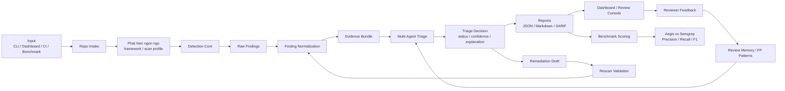
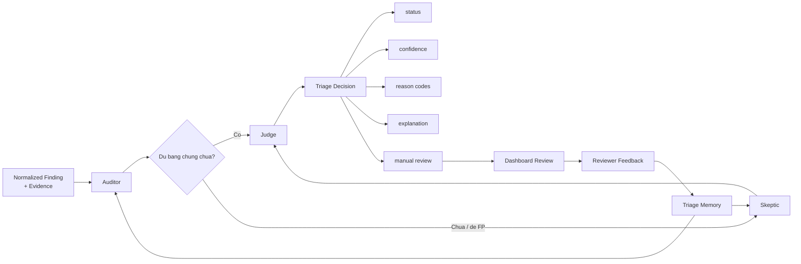

# Workflow Mermaid Don Gian Cho Aegis-SAST

## 1. Workflow Tong The De Ve Lai Trong Excalidraw

## 2. Workflow Multi-Agent Don Gian

## 3. Neu Muon Ve Bang Box Trong Excalidraw

Thu tu cac khoi nen dat tu trai qua phai:

1. Input
2. Repo Intake
3. Detection Core
4. Raw Findings
5. Finding Normalization
6. Evidence Bundle
7. Multi-Agent Triage
8. Triage Decision
9. Reports
10. Dashboard / Review
11. Reviewer Feedback
12. Review Memory
13. Benchmark Scoring
14. Aegis vs Semgrep
15. Remediation Draft
16. Rescan Validation
