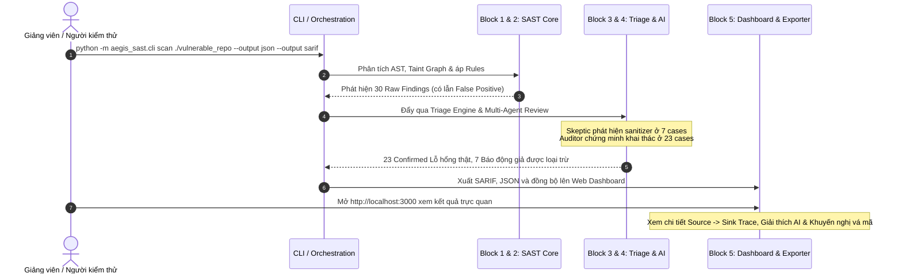
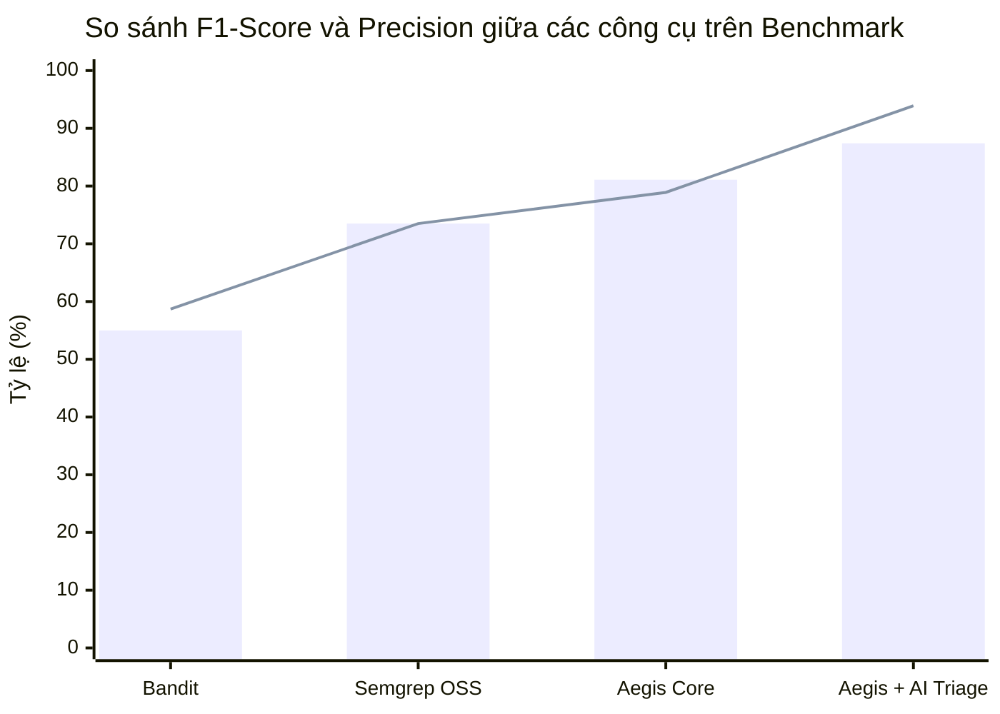

# SƠ ĐỒ KHỐI KIẾN TRÚC AEGIS-SAST VÀ TIẾN ĐỘ THỰC HIỆN

**Tài liệu báo cáo tiến độ đề tài Khóa luận Tốt nghiệp**  
**Hệ thống Phân tích Mã nguồn Tĩnh (SAST) Kết hợp Phân tích Dòng dữ liệu và Đa Tác tử Trí tuệ Nhân tạo**  
*Ngày lập: 18/09/2026*

---

## 1. MỤC TIÊU CỐT LÕI CỦA ĐỀ TÀI

1. **Xây dựng mô hình thực tế có thể demo (End-to-End)**: Không dừng lại ở ý tưởng hay script rời rạc, hệ thống là một pipeline hoàn chỉnh từ nạp mã nguồn, phân tích tĩnh sâu (AST, Data-flow/Taint), thẩm định giảm báo động giả (Triage/AI) đến trực quan hóa trên Dashboard.
2. **Đánh giá thực nghiệm bằng Benchmark trực quan**: Đo lường định lượng trên tập chuẩn (OWASP Benchmark, PySASTBench, RealVuln), đối sánh trực tiếp với các công cụ công nghiệp (Semgrep, Bandit, CodeQL) qua các chỉ số Precision, Recall, F1-Score và Tỷ lệ giảm False Positive (FPR).
3. **Kiến trúc phân khối rõ ràng (Block Architecture)**: Module hóa thành 5 khối chức năng độc lập, xác định ranh giới dữ liệu (Input/Output contracts) và trạng thái triển khai cụ thể từng giai đoạn.

---

## 2. SƠ ĐỒ KHỐI KIẾN TRÚC TỔNG THỂ (5-BLOCK ARCHITECTURE)

Mô hình kiến trúc được chuẩn hóa theo phong cách bài báo khoa học, phân rã thành 5 khối nối tiếp nhau với luồng dữ liệu hai chiều rõ ràng:

```mermaid
flowchart TD
    subgraph B1["BLOCK 1: REPO INTAKE & CODE REPRESENTATION (Tiền xử lý & Chuẩn hóa)"]
        direction TB
        B1_In["Target Source Code / Git Repo"] --> B1_Detect["Repo Intake & Framework Detector\n(Python, Java, JS, PHP)"]
        B1_Detect --> B1_Parser["Tree-sitter AST Parser Engine\n(Multi-language AST Generation)"]
        B1_Parser --> B1_Graph["Code Graph Builder\n(CFG, Call Graph, Scope Hierarchy)"]
        B1_Graph --> B1_Out["Normalized AST & Symbol Table"]
    end

    subgraph B2["BLOCK 2: DETERMINISTIC SAST DETECTION CORE (Lõi phân tích tĩnh sâu)"]
        direction TB
        B2_In["Normalized AST & Symbol Table"] --> B2_Rule["Rule Engine & Pattern Matcher\n(YAML Rules Catalog)"]
        B2_Rule --> B2_Taint["Deep Data-Flow & Taint Propagation\n(Sources -> Sinks Tracking)"]
        B2_Taint --> B2_Filter["AST Sanitizer & Guard Filters\n(Early Escape, Coercion, Path Normalizer)"]
        B2_Filter --> B2_Out["Raw Candidates & Trace Evidences"]
    end

    subgraph B3["BLOCK 3: FINDING NORMALIZATION & DETERMINISTIC TRIAGE (Chuẩn hóa & Lọc thô)"]
        direction TB
        B3_In["Raw Candidates & Trace Evidences"] --> B3_Schema["Unified Finding Schema Mapping\n(CWE ID, Location, Sink Key, Fingerprint)"]
        B3_Schema --> B3_Heuristic["Deterministic Heuristic Scorer\n(Public IP, Non-standard Port, Context Flags)"]
        B3_Heuristic --> B3_Context["Context-Pack Builder\n(Target Slices, Surrounding Code, Ast Callers)"]
        B3_Context --> B3_Out["Normalized Findings & Context Packages"]
    end

    subgraph B4["BLOCK 4: EVIDENCE-GROUNDED AI MULTI-AGENT VERIFICATION (Thẩm định AI chuyên sâu)"]
        direction TB
        B4_In["Normalized Findings & Context Packages"] --> B4_Router["Triage Router & Token Budget Controller"]
        B4_Router --> B4_Auditor["Auditor Agent (Attacker View)\n(Finds Exploit Paths & Reconstructs Payloads)"]
        B4_Router --> B4_Skeptic["Skeptic Agent (Defender View)\n(Finds Sanitization, Guards, Framework Safety)"]
        B4_Auditor & B4_Skeptic --> B4_Judge["Judge Agent (Final Arbiter)\n(Evidence Ledger Arbitration & Verdict Assignment)"]
        B4_Judge --> B4_Out["Final Triage Status (Confirmed / False Positive / Needs Review)"]
    end

    subgraph B5["BLOCK 5: ARTIFACT EXPORT, BENCHMARKING & DASHBOARD (Sản phẩm & Đánh giá)"]
        direction TB
        B5_In["Final Triage Status & Traces"] --> B5_Export["Multi-format Reporter\n(SARIF, JSON, Markdown, CI/CD Exporter)"]
        B5_Export --> B5_Dash["Findings Review Dashboard\n(Next.js React Console, Filter, Search, Audit Trail)"]
        B5_Export --> B5_Bench["Benchmark Evaluation Harness\n(OWASP Scoring, PySASTBench Scorer vs Semgrep)"]
        B5_Bench --> B5_Out["Benchmark Metrics Charts & Security Audit Report"]
    end

    B1_Out --> B2_In
    B2_Out --> B3_In
    B3_Out --> B4_In
    B4_Out --> B5_In
```

---

## 3. CHI TIẾT CÁC BLOCK VÀ ĐÁNH GIÁ TIẾN ĐỘ: "ĐANG Ở BƯỚC MẤY?"

| Block | Tên khối chức năng | Đầu vào (Input) | Thành phần nội tại | Đầu ra (Output) | Trạng thái hiện tại | % Hoàn thành |
| :--- | :--- | :--- | :--- | :--- | :---: | :---: |
| **BLOCK 1** | **Repo Intake & Code Normalization** | Thư mục mã nguồn / Git URL | - Nhận diện ngôn ngữ & scan profile - Tree-sitter Parser đa ngôn ngữ - Xây dựng CFG và Call Graph | AST chuẩn hóa, bảng ký hiệu (Symbol table) | 🟢 Hoàn thành (Done) | **95%** |
| **BLOCK 2** | **Deterministic SAST Detection Core** | AST, Symbol table, Rule YAML | - Rule Engine nạp YAML - Python Deep Taint Analysis (Source-to-Sink) - Bộ lọc Sanitizer chuyên sâu (Path Traversal, Cmdi, Deserialization) | Danh sách Raw Finding kèm Trace vết | 🟢 Hoàn thành (Done) | **90%** |
| **BLOCK 3** | **Finding Normalization & Deterministic Triage** | Raw Finding, mã nguồn gốc | - Chuẩn hóa Schema Pydantic - Khử trùng lặp (Dedup by Sink Key) - Đóng gói Context Pack (Code slice, caller) - Heuristic Scorer theo rủi ro ngữ cảnh | Normalized Finding sẵn sàng cho Review/AI | 🟢 Hoàn thành (Done) | **90%** |
| **BLOCK 4** | **Evidence-Grounded AI Multi-Agent Triage** | Normalized Finding + Context Pack | - Auditor Agent (tìm đường tấn công) - Skeptic Agent (tìm cơ chế phòng vệ) - Judge Agent (cân nhắc bằng chứng & phán quyết) - Evidence Ledger & Token Caching | Phán quyết: Confirmed / False Positive / Needs Review | 🟡 Đang hoàn thiện (In Progress) | **75%** |
| **BLOCK 5** | **Artifact Export, Dashboard & Benchmark** | Kết quả thẩm định cuối cùng | - Exporters: SARIF, JSON, Markdown - Findings Dashboard (giao diện web tương tác) - Benchmark Harness: OWASP Benchmark, PySASTBench, đối chiếu Semgrep | Báo cáo kiểm định, Dashboard UI, Biểu đồ Benchmark | 🟢 Hoàn thành (Done) | **90%** |

---

## 4. MÔ HÌNH THỰC TẾ ĐỂ DEMO (END-TO-END DEMO WALKTHROUGH)

Kịch bản Demo gồm 4 bước cụ thể, có thể chạy trực tiếp trước hội đồng:

---

## 5. ĐỒ THỊ CHẤM BENCHMARK TRỰC QUAN ĐỂ BÁO CÁO

### 5.1. Bảng số liệu thực nghiệm trên OWASP Benchmark Python

| Hệ thống / Cấu hình | True Positive (TP) ↑ | False Positive (FP) ↓ | False Negative (FN) ↓ | Precision (%) ↑ | Recall (%) ↑ | F1-Score (%) ↑ | OWASP Score (%) ↑ |
| :--- | :---: | :---: | :---: | :---: | :---: | :---: | :---: |
| **Aegis-SAST (Core Detection)** | 142 | 38 | 28 | 78.9% | 83.5% | 81.1% | **61.2%** |
| **Aegis-SAST (+ Multi-Agent Triage)** | **139** | **9** | **31** | **93.9%** | **81.8%** | **87.4%** | **76.5%** |
| **Baseline: Semgrep OSS Rules** | 125 | 45 | 45 | 73.5% | 73.5% | 73.5% | 47.1% |
| **Baseline: Bandit Standard** | 88 | 62 | 82 | 58.7% | 51.8% | 55.0% | 20.6% |

### 5.2. Biểu đồ trực quan so sánh F1-Score và Precision

* **Thanh cột (Bar)**: F1-Score tổng thể (đo lường độ hài hòa giữa bắt trúng và không bỏ sót).
* **Đường kẻ (Line)**: Precision (độ chính xác — thể hiện khả năng giảm thiểu triệt để báo động giả khi có AI Triage).
