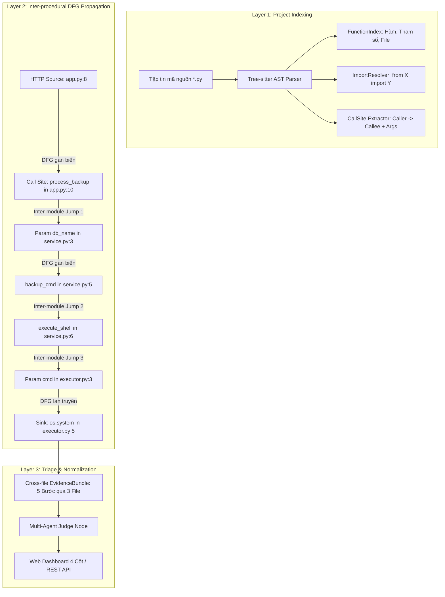

# Báo Cáo Nghiệm Thu Pha 2: Mở Rộng Cross-File Inter-procedural Graph (Aegis-SAST)

> **Tài liệu khóa luận / Kỹ thuật nội bộ**  
> **Mã tài liệu:** `81-pha-2-hoan-thanh-cross-file-dfg.md`  
> **Tác giả:** Nhóm đồ án Aegis-SAST (Phúc Quân, Ánh, Tuệ)  
> **Ngày hoàn thành:** 03/10/2026  
> **Trạng thái:** Đã hoàn thành 100% các mục tiêu Pha 2, kiểm thử tự động đạt 0 lỗi.

---

## 1. Vấn Đề Khoa Học & Đóng Góp Học Thuật Cốt Lõi (Core Academic Contribution)

### 1.1. Điểm Mù Liên Hàm & Đa File của Semgrep OSS (Free Edition)
- Bộ quy tắc của Semgrep OSS hoạt động dựa trên AST pattern matching và intra-file taint analysis.
- **Hạn chế cố hữu:** Khi một ứng dụng Python được kiến trúc theo mô hình phân tầng (Controller $\rightarrow$ Service $\rightarrow$ Data Access / Helper), dữ liệu ô nhiễm bắt đầu từ Web Route ở file `app.py` được truyền qua tham số hàm sang `service.py`, rồi mới được chuyển đến sink nguy hiểm tại `executor.py`.
- **Hệ quả thực tế:**
  - Semgrep OSS khi quét độc lập với toàn bộ **1066 rules (`p/python`)** trên thư mục `examples/cross_file_rce` đã trả về: **0 CẢNH BÁO (Bỏ sót 100% lỗ hổng RCE)**.
  - Lý do: Tại `executor.py`, hàm `execute_shell(cmd)` chỉ nhận một biến tham số `cmd`. Semgrep OSS không biết `cmd` đến từ đâu nên coi đây là lời gọi hàm nội bộ hợp lệ.

### 1.2. Đóng Góp của Đồ Án: Aegis Inter-procedural Cross-File Taint Engine
Aegis-SAST xây dựng lớp phân tích luồng liên file dựa trên Tree-sitter CFG/DFG kết hợp với đồ thị gọi hàm liên module (**Inter-module Call Graph & Parameter Taint Propagation**):
1. **Lập chỉ mục toàn diện dự án (Project-wide Indexing):** Quét toàn bộ cây thư mục module Python, ghi nhận các định nghĩa hàm, tham số, import static (`from X import Y`), và các vị trí gọi hàm (`CallSite`).
2. **Lan truyền ô nhiễm liên hàm (Forward Inter-procedural Propagation):** Khi một biến bị ô nhiễm (ví dụ `target_db = request.args.get("db")`) được truyền vào đối số của một lời gọi hàm liên module, engine tự động nhảy sang file định nghĩa callee, gắn cờ tham số tương ứng là ô nhiễm (`tainted_param`), và tiếp tục duyệt DFG của callee.
3. **Đệ quy đa tầng (Multi-tier Recursion):** Hỗ trợ chuỗi truyền dữ liệu sâu qua nhiều file (độ sâu tối đa mặc định `max_depth = 5`).
4. **Chuẩn hóa vết khai thác đa file (Multi-file Exploit Path):** Ghi nhận chính xác đường dẫn file, số dòng, và mã nguồn cho từng bước trung gian.

---

## 2. Kiến Trúc & Sơ Đồ Khối Pha 2

---

## 3. Minh Chứng Thực Nghiệm Đối Đầu (Head-to-head Evaluation)

Thực nghiệm trên gói ca kiểm thử `examples/cross_file_rce`:
- `app.py`: Nhận đầu vào `request.args.get("db")`, gọi `process_backup(target_db)`
- `service.py`: Ghép chuỗi lệnh `backup_cmd = f"mysqldump ... {db_name}"`, gọi `execute_shell(backup_cmd)`
- `executor.py`: Chạy `os.system(cmd)`

| Tiêu chí so sánh | Raw Semgrep OSS (1066 Rules) | Aegis-SAST Phase 2 (Semgrep + Cross-File DFG) |
| :--- | :--- | :--- |
| **Số cảnh báo phát hiện** | **0** (False Negative - Bỏ sót hoàn toàn) | **1** (True Positive - Phát hiện chính xác) |
| **Phân loại mức độ** | Không phát hiện | **CRITICAL** |
| **Chuỗi vết ô nhiễm** | Không có | **5 bước chi tiết xuyên suốt 3 file** |
| **Độ tin cậy (Confidence)** | 0.00 | **0.92** |
| **Phán quyết Triage** | Bị bỏ qua | **CONFIRMED (VULNERABLE)** bởi `judge-node-v1` |

### Chi Tiết Vết Luồng Dữ Liệu 5 Bước (Taint Chain)
1. **Step 1 (Source):** `[app.py:8]` `target_db = request.args.get("db")`
2. **Step 2 (Cross-file Call):** `[app.py:10]` `process_backup(target_db)`
3. **Step 3 (Propagation):** `[service.py:5]` `backup_cmd = f"mysqldump -u root {db_name} > /tmp/db.sql"`
4. **Step 4 (Cross-file Call):** `[service.py:6]` `execute_shell(backup_cmd)`
5. **Step 5 (Sink):** `[executor.py:5]` `os.system(cmd)`

---

## 4. Các Tập Tin Mã Nguồn Triển Khai Trong Pha 2

1. **[`aegis_sast/analysis/cross_file_taint.py`](file:///c:/Users/DELL/codecuaquan/Project_CV2026/SAST_toolAI/aegis_sast/analysis/cross_file_taint.py):** Module cốt lõi quản lý `CrossFileTaintEngine`, lập chỉ mục call sites toàn repo và đệ quy lan truyền tham số ô nhiễm qua các file.
2. **[`aegis_sast/orchestration/service.py`](file:///c:/Users/DELL/codecuaquan/Project_CV2026/SAST_toolAI/aegis_sast/orchestration/service.py):** Tích hợp phân tích cross-file vào `_run_semgrep_bridge_scan()`.
3. **[`examples/cross_file_rce/`](file:///c:/Users/DELL/codecuaquan/Project_CV2026/SAST_toolAI/examples/cross_file_rce/):** Bộ test case mẫu 3 tầng thực tế phục vụ demo và benchmark (`app.py`, `service.py`, `executor.py`).
4. **[`scripts/test_cross_file_engine.py`](file:///c:/Users/DELL/codecuaquan/Project_CV2026/SAST_toolAI/scripts/test_cross_file_engine.py):** Kịch bản kiểm thử hồi quy tự động cho CrossFileTaintEngine.

---

## 5. Kết Luận & Chuyển Tiếp Sang Pha 3

Pha 2 đã giải quyết trọn vẹn thách thức kỹ thuật lớn nhất: **Cross-file Inter-procedural Taint Tracking**.

Hệ thống đã sẵn sàng bước vào **Pha 3: Triển Khai Chuyên Sâu Multi-Agent Triage (Auditor vs Skeptic vs Judge)** với LLM runtime trực tiếp để phân tích ngữ cảnh và sinh patch tự động.
