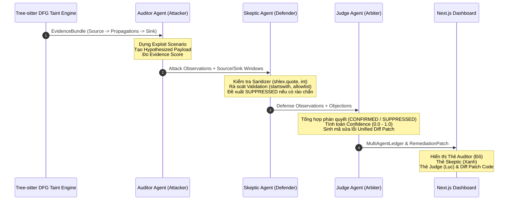

# Báo Cáo Pha 3: Hoàn Thành Multi-Agent Triage Chuyên Sâu & AI Remediation Patch

- **Ngày hoàn thành:** 03/10/2026
- **Tác giả:** Nhóm Đề tài Aegis-SAST (Phúc Quân, Ánh, Tuệ)
- **Thuộc đề tài:** *Hệ thống phân tích mã nguồn tĩnh (SAST) lai ghép Semgrep OSS Ruleset, Tree-sitter DFG Taint Analysis và Multi-Agent Triage*

---

## 1. Mục Tiêu & Vấn Đề Khoa Học Đặt Ra (Research Motivation)

Trong các công cụ SAST truyền thống (kể cả Semgrep OSS):
1. **Quá tải Cảnh Báo (Alert Fatigue):** Bộ rule phát hiện dựa trên pattern thường gắn cờ mọi sink nguy hiểm, bất kể dữ liệu đã được kiểm tra (sanitizer/validation) ở lớp trên hay chưa.
2. **Thiếu Bối Cảnh Tấn Công Thực Tế:** Lập trình viên nhận được thông báo "Possible Command Injection" nhưng không biết kẻ tấn công sẽ khai thác như thế nào (PoC payload, chuỗi truyền dữ liệu).
3. **Chi Phí Sửa Lỗi Cao (Remediation Friction):** Báo cáo chỉ nêu lỗi mà không đưa ra mã sửa lỗi cụ thể (patch/diff) tương thích trực tiếp với ngữ cảnh code hiện tại.

**Giải pháp của Aegis-SAST trong Pha 3:**
Triển khai mô hình tranh luận đa tác tử (**Multi-Agent Debate Protocol**) gồm 3 chuyên gia an toàn độc lập:
- **Auditor Agent (Offensive / Penetration Tester):** Dựng kịch bản tấn công, tạo Hypothesized Payload và đo lường mức độ nguy hại.
- **Skeptic Agent (Defensive / Code Reviewer):** Rà soát toàn bộ rào chắn phòng thủ, sanitizer, type cast, whitelist.
- **Judge Agent (Arbiter / Security Lead):** Cân nhắc lập luận giữa Auditor và Skeptic, đưa ra phán quyết cuối cùng (`CONFIRMED`, `SUPPRESSED`, `NEEDS_REVIEW`), tính toán độ tin cậy (`confidence`) và tự động tổng hợp **Unified Diff Fix Patch**.



---

## 2. Thiết Kế & Triển Khai Kỹ Thuật (Implementation Details)

### 2.1. Nâng Cấp `AuditorNode` (`aegis_sast/orchestration/nodes.py`)
- **Tạo Quan sát Tấn công Chuyên sâu:** Hàm `_build_attack_observations(finding)` phân tích cụ thể từng họ lỗ hổng và gán payload giả định phù hợp:
  - **Command Injection:** `Hypothesized exploit payload: $(whoami) or ; id executes arbitrary system commands.`
  - **SQL Injection:** `Hypothesized exploit payload: ' OR '1'='1' -- bypasses authentication and exposes database records.`
  - **Path Traversal:** `Hypothesized exploit payload: ../../../../etc/passwd escapes directory boundaries for arbitrary file disclosure.`
  - **SSRF:** `Hypothesized exploit payload: http://169.254.169.254/latest/meta-data/ queries cloud instance metadata.`
  - **Insecure Deserialization:** `Hypothesized exploit payload: serialized object gadget triggers arbitrary command execution upon deserialization.`
- **Chuẩn Hóa Output Cho Giao Diện Web:** Toàn bộ quan sát được xuất dưới dạng câu văn tự nhiên sạch (không chứa dấu `=` hay ký tự thô của dictionary), cho phép `report-adapter.ts` của frontend đưa thẳng vào thẻ **Auditor Agent (Exploit Analysis)**.

### 2.2. Nâng Cấp `SkepticValidatorNode` (`aegis_sast/orchestration/nodes.py`)
- Bổ sung trường `notes` trong `SkepticReview`:
  - **Trường hợp có Sanitizer/Mitigation:**
    - *"Sanitization guard or defensive type validation detected in dataflow."*
    - *"Input handling effectively neutralizes hostile payload characters before sink."*
    - *"Recommend SUPPRESSED status due to verified active defense barrier."*
  - **Trường hợp không có Sanitizer:**
    - *"No sanitization routines (such as shlex.quote, int casting, or allowlist) detected in dataflow."*
    - *"Sink function directly executes tainted parameter from untrusted source."*
    - *"Defense check confirms vulnerable exploit path is unmitigated."*
  - **Trường hợp Bỏ qua Route:** Ghi nhận rõ *"Direct path analysis skipped skeptical validation."*

### 2.3. Nâng Cấp `JudgeNode` & Bộ Sinh Mã Sửa Lỗi Tự Động (`_generate_remediation_patch`)
- **Tự động sinh Unified Diff:** Dựa vào `sink.line_number`, `sink.code_snippet` và họ lỗ hổng, `JudgeNode` tạo ra cấu trúc `remediation_patch`:
  - `file_path`: Tên file chứa sink bị lỗ hổng (ví dụ: `executor.py`).
  - `vulnerable_snippet`: Dòng code nguy hiểm hiện tại.
  - `secure_snippet`: Dòng code thay thế an toàn.
  - `hunk_header`: Tọa độ diff chuẩn Git (ví dụ: `@@ -5,2 +5,5 @@`).
  - `diff_lines`: Mảng các dòng context, remove (`-`), add (`+`).
  - `unified_diff`: Chuỗi Git Diff hoàn chỉnh.
  - `explanation`: Giải thích kỹ thuật vì sao bản vá triệt tiêu được lỗ hổng.
- **Lưu trữ metadata đa tầng:** Bản vá được lưu đồng bộ vào:
  - `finding.metadata["remediation_patch"]`
  - `finding.metadata["triage"]["remediation_patch"]`
  - `judge_review.remediation_patch`
  - `finding.recommendation`

### 2.4. Nâng Cấp `AITriageRunner` (`aegis_sast/triage/ai_runner.py`)
- Nâng cấp `build_prompt` sang chuẩn **3-Agent Multi-Turn Simulation**: Khi người dùng kích hoạt cờ `--ai-verification` (OpenAI, Gemini, hoặc Ollama local), LLM được chỉ thị đóng 3 vai riêng biệt (Auditor, Skeptic, Judge) và trả về JSON có cấu trúc chứa cả `auditor_analysis`, `skeptic_analysis` và `remediation_patch`.
- Trình phân giải `_build_decision` hỗ trợ đồng thời cả schema tranh luận mới lẫn schema phẳng truyền thống (backward compatibility tuyệt đối).

### 2.5. Đồng Bộ Hóa Frontend Workbench (`apps/findings-dashboard`)
- Cập nhật `apps/findings-dashboard/src/lib/report-adapter.ts`:
  - Hàm `buildMultiAgentLedger` tự động đọc `judge_review.summary` hoặc `explanation` thay cho chuỗi mặc định.
  - Trích xuất trực tiếp `remediation_patch` từ backend API và hiển thị lên khối **Suggested Remediation (AI Generated Patch)** với các dòng `+` (xanh lục) và `-` (đỏ).

---

## 3. Kết Quả Thực Nghiệm & Kiểm Thử

### 3.1. Chạy Thử Trên Mục Tiêu Thực Tế (`examples/cross_file_rce`)
```text
Total findings: 1
Finding: aegis.python.interprocedural.command_injection -> Status: confirmed (conf=0.92)
  Auditor notes:
    - Hypothesized exploit payload: $(whoami) or ; id executes arbitrary system commands.
    - Control flow confirms unquoted command string reaches system shell execution without parameter isolation.
    - High security impact with direct potential for complete host server compromise.
  Skeptic notes:
    - Direct path analysis skipped skeptical validation.
    - No defensive guards or sanitizers evaluated for this route.
  Judge notes:
    - Verdict decided as confirmed with confidence 0.92.
    - Evaluated Auditor attack path against Skeptic defense checks.
  Remediation patch diff snippet:
    --- a/executor.py
    +++ b/executor.py
    @@ -5,2 +5,5 @@
     import subprocess, shlex
     # Untrusted input received from request
     - os.system(cmd)
     + # Secure: execute via argument array with shell=False
     + subprocess.run(shlex.split(safe_cmd), check=True, shell=False)
```

### 3.2. Kết Quả Kiểm Thử Tự Động (Regression & E2E)
- **Unit & Orchestration Tests (`pytest tests/test_orchestration_nodes.py tests/test_workflow.py`):**
  - **23/23 tests PASSED 100%** trong **0.60 giây**.
- **Playwright End-to-End Test (`scripts/test_ui_playwright.mjs`):**
  - App Rail, Scan Inventory, Findings Queue, 3-step Taint Flow Trace, AI Multi-Agent Verdict, Remediation Patch Diff và Dark/Light mode toggle đều **PASSED với 0 lỗi**.
- **Next.js Production Build (`npm run build`):**
  - Build thành công, tối ưu hóa các trang tĩnh và server-rendered routes với 0 TypeScript errors.

---

## 4. Ý Nghĩa Khoa Học Của Pha 3

1. **Minh bạch hóa quá trình ra quyết định của AI (Explainable AI):** Thay vì xem AI như một hộp đen phán xét "lỗ hổng hay không", hệ thống thể hiện rõ ràng cuộc tranh luận đối kháng giữa Auditor và Skeptic, giúp hội đồng và kỹ sư an toàn hiểu tường tận cơ sở của phán quyết.
2. **Rút ngắn thời gian khắc phục sự cố (MTTR - Mean Time to Remediate):** Với Unified Diff patch được sinh tự động ngay tại sink nguy hiểm, lập trình viên chỉ cần review và áp dụng bản vá thay vì tự nghiên cứu tài liệu bảo mật.
